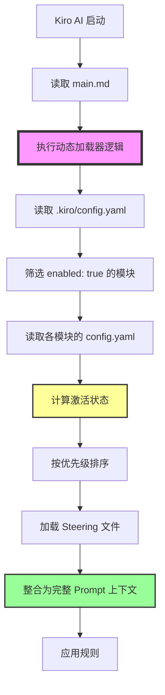
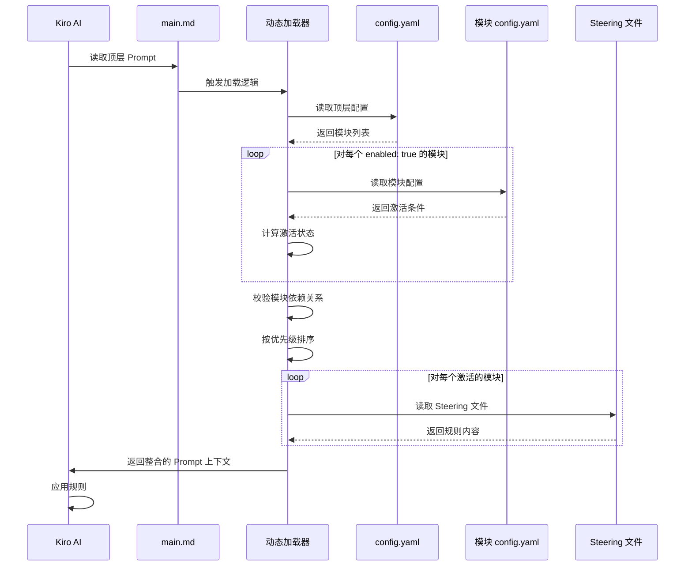

# 设计文档：动态模块加载器

## 概述

动态模块加载器是 Kiro Prompt 基座的核心功能，实现了模块化的 Prompt 管理系统。该系统通过读取配置文件、计算模块激活状态、按优先级加载 Steering 规则，实现了灵活的功能模块管理。

### 设计目标

1. **模块化管理**：支持功能模块的独立开发、版本管理和灵活组合
2. **条件激活**：支持全局开关和自定义条件的双层激活机制
3. **优先级控制**：支持模块间的优先级管理和冲突解决
4. **层级化组织**：建立清晰的 Prompt 层级结构（L0 > L1 > L2）
5. **容错性**：优雅处理各种错误情况，确保系统稳定运行

### 核心理念

- **配置驱动**：所有模块的启用/禁用、版本选择、优先级都通过配置文件管理
- **条件激活**：模块不仅可以通过全局开关控制，还可以根据场景（目录、文件类型等）自动激活
- **Prompt 即代码**：将 Prompt 规则视为代码，采用模块化、版本化的管理方式
- **渐进式增强**：系统从最小可用配置开始，逐步加载和应用模块规则

## 架构

### 系统架构图



### 层级结构

```
L0: 顶层入口 Prompt (.kiro/steering/main.md)
    ├─ 系统说明
    ├─ 使用指南
    └─ L1: 动态加载器逻辑（嵌入在 main.md 中）
        ├─ 读取配置
        ├─ 计算激活状态
        ├─ 按优先级排序
        └─ L2: 激活的模块 Steering 规则
            ├─ workflow (priority: 200)
            ├─ ai-dev (priority: 100)
            ├─ git-commit (priority: 80)
            └─ git-rollback (priority: 70)
```

### 数据流



## 组件和接口

### 组件 1：配置读取器（Config Reader）

**职责**：读取和解析配置文件，并校验版本号格式

**输入**：
- 配置文件路径（`.kiro/config.yaml` 或 `.kiro/modules/{module}/{version}/config.yaml`）

**输出**：
- 配置对象（包含模块列表、版本、优先级、激活条件等）

**错误处理**：
- 文件不存在 → 返回默认配置（空模块列表）
- 格式错误 → 输出错误详情，返回默认配置
- 版本号不符合 SemVer 规范 → 输出警告，跳过该模块

**版本号校验规则**：
- 必须符合语义化版本 2.0.0 规范：`MAJOR.MINOR.PATCH`
- 支持预发布版本：`MAJOR.MINOR.PATCH-prerelease`
- 支持构建元数据：`MAJOR.MINOR.PATCH+build`
- 支持版本后缀（用于区分变体）：`MAJOR.MINOR.PATCH-variant`
- 示例：`v1.0.0`, `v1.0.0-simple`, `v1.2.3-alpha.1`, `v2.0.0+20130313144700`

**伪代码**：

```python
import re

def read_config(config_path: str) -> dict:
    """
    读取配置文件
    
    Args:
        config_path: 配置文件路径
        
    Returns:
        配置对象字典
    """
    try:
        # 读取 YAML 文件
        with open(config_path, 'r') as f:
            config = yaml.safe_load(f)
        
        # 验证必需字段
        if 'modules' not in config:
            log_warning(f"配置文件缺少 'modules' 字段: {config_path}")
            return {'modules': {}}
        
        # 校验每个模块的版本号
        validated_modules = {}
        for module_name, module_config in config['modules'].items():
            if 'version' in module_config:
                version = module_config['version']
                if not validate_semver(version):
                    log_warning(f"模块 {module_name} 的版本号不符合 SemVer 规范: {version}，跳过该模块")
                    continue
            
            validated_modules[module_name] = module_config
        
        config['modules'] = validated_modules
        return config
    
    except FileNotFoundError:
        log_error(f"配置文件不存在: {config_path}")
        return {'modules': {}}
    
    except yaml.YAMLError as e:
        log_error(f"配置文件格式错误: {config_path}, 错误: {e}")
        return {'modules': {}}


def validate_semver(version: str) -> bool:
    """
    校验版本号是否符合语义化版本 2.0.0 规范
    
    Args:
        version: 版本号字符串
        
    Returns:
        是否符合规范
    """
    # 移除可选的 'v' 前缀
    if version.startswith('v'):
        version = version[1:]
    
    # SemVer 2.0.0 正则表达式
    # 格式：MAJOR.MINOR.PATCH[-prerelease][+build]
    semver_pattern = r'^(0|[1-9]\d*)\.(0|[1-9]\d*)\.(0|[1-9]\d*)(?:-((?:0|[1-9]\d*|\d*[a-zA-Z-][0-9a-zA-Z-]*)(?:\.(?:0|[1-9]\d*|\d*[a-zA-Z-][0-9a-zA-Z-]*))*))?(?:\+([0-9a-zA-Z-]+(?:\.[0-9a-zA-Z-]+)*))?$'
    
    return bool(re.match(semver_pattern, version))
```

### 组件 2：激活状态计算器（Activation Calculator）

**职责**：计算模块的最终激活状态

**输入**：
- 模块配置（global_switch, activation_conditions）
- 当前上下文（current_directory, current_file_type）

**输出**：
- 激活状态（True/False）

**计算规则**：
```
Activation_State = Global_Switch AND Module_Condition

其中：
- Global_Switch: config.yaml 中的 enabled 字段
- Module_Condition: 模块 config.yaml 中的 activation_conditions 匹配结果
```

**支持的条件类型**：
1. `always`: 始终激活
2. `directory_match`: 按目录路径匹配（支持通配符 `*`）
3. `file_type_match`: 按文件类型匹配
4. `and`: 逻辑与组合（所有子条件都满足）
5. `or`: 逻辑或组合（任一子条件满足）

**伪代码**：

```python
def calculate_activation(
    global_switch: bool,
    activation_conditions: dict,
    context: dict
) -> bool:
    """
    计算模块激活状态
    
    Args:
        global_switch: 全局开关状态
        activation_conditions: 激活条件配置
        context: 当前上下文（目录、文件类型等）
        
    Returns:
        是否激活
    """
    # 如果全局开关关闭，直接返回 False
    if not global_switch:
        return False
    
    # 如果没有配置激活条件，默认为 always: true
    if not activation_conditions:
        return True
    
    # 计算条件匹配结果
    return evaluate_condition(activation_conditions, context)


def evaluate_condition(condition: dict, context: dict) -> bool:
    """
    递归评估激活条件
    
    Args:
        condition: 条件配置（可能是单个条件或组合条件）
        context: 当前上下文
        
    Returns:
        条件是否满足
    """
    # 情况 1：always 条件
    if condition.get('always'):
        return True
    
    # 情况 2：directory_match 条件
    if 'directory_match' in condition:
        patterns = condition['directory_match']
        if not isinstance(patterns, list):
            patterns = [patterns]
        
        current_dir = context.get('current_directory', '')
        for pattern in patterns:
            if match_pattern(current_dir, pattern):
                return True
        return False
    
    # 情况 3：file_type_match 条件
    if 'file_type_match' in condition:
        patterns = condition['file_type_match']
        if not isinstance(patterns, list):
            patterns = [patterns]
        
        current_file = context.get('current_file_type', '')
        for pattern in patterns:
            if current_file.endswith(pattern):
                return True
        return False
    
    # 情况 4：AND 逻辑组合
    if 'and' in condition:
        sub_conditions = condition['and']
        if not isinstance(sub_conditions, list):
            return False
        
        # 所有子条件都必须满足
        for sub_condition in sub_conditions:
            if not evaluate_condition(sub_condition, context):
                return False
        return True
    
    # 情况 5：OR 逻辑组合
    if 'or' in condition:
        sub_conditions = condition['or']
        if not isinstance(sub_conditions, list):
            return False
        
        # 任一子条件满足即可
        for sub_condition in sub_conditions:
            if evaluate_condition(sub_condition, context):
                return True
        return False
    
    # 如果没有匹配任何条件类型，返回 False
    return False


def match_pattern(path: str, pattern: str) -> bool:
    """
    匹配路径模式（支持通配符 *）
    
    Args:
        path: 实际路径
        pattern: 模式字符串
        
    Returns:
        是否匹配
    """
    import fnmatch
    return fnmatch.fnmatch(path, pattern)
```

### 组件 3：依赖校验器（Dependency Validator）

**职责**：校验模块依赖关系，确保依赖的模块已激活

**输入**：
- 激活的模块列表（包含模块名、版本、依赖信息）

**输出**：
- 依赖校验通过的模块列表
- 依赖校验失败的模块列表（包含失败原因）

**校验规则**：
1. 对于每个模块，检查其 dependencies 字段
2. 确保所有依赖的模块都在激活列表中
3. 检测循环依赖（A 依赖 B，B 依赖 A）
4. 依赖不满足的模块不应该被加载

**伪代码**：

```python
def validate_dependencies(
    activated_modules: list[dict]
) -> tuple[list[dict], list[dict]]:
    """
    校验模块依赖关系
    
    Args:
        activated_modules: 激活的模块列表
        
    Returns:
        (依赖校验通过的模块列表, 依赖校验失败的模块列表)
    """
    # 构建模块名称集合（用于快速查找）
    module_names = {m['name'] for m in activated_modules}
    
    # 检测循环依赖
    circular_deps = detect_circular_dependencies(activated_modules)
    if circular_deps:
        log_error(f"检测到循环依赖: {circular_deps}")
    
    valid_modules = []
    invalid_modules = []
    
    for module in activated_modules:
        module_name = module['name']
        dependencies = module.get('dependencies', [])
        
        # 检查是否在循环依赖中
        if module_name in circular_deps:
            invalid_modules.append({
                'module': module,
                'reason': f"循环依赖: {circular_deps}"
            })
            log_warning(f"模块 {module_name} 存在循环依赖，跳过加载")
            continue
        
        # 检查所有依赖是否满足
        missing_deps = []
        for dep in dependencies:
            if dep not in module_names:
                missing_deps.append(dep)
        
        if missing_deps:
            invalid_modules.append({
                'module': module,
                'reason': f"缺少依赖: {missing_deps}"
            })
            log_warning(f"模块 {module_name} 缺少依赖 {missing_deps}，跳过加载")
        else:
            valid_modules.append(module)
            log_info(f"模块 {module_name} 依赖校验通过")
    
    return valid_modules, invalid_modules


def detect_circular_dependencies(modules: list[dict]) -> set[str]:
    """
    检测循环依赖
    
    Args:
        modules: 模块列表
        
    Returns:
        存在循环依赖的模块名称集合
    """
    # 构建依赖图
    dep_graph = {}
    for module in modules:
        module_name = module['name']
        dependencies = module.get('dependencies', [])
        dep_graph[module_name] = dependencies
    
    # 使用 DFS 检测环
    visited = set()
    rec_stack = set()
    circular = set()
    
    def dfs(node: str) -> bool:
        """DFS 检测环"""
        visited.add(node)
        rec_stack.add(node)
        
        for neighbor in dep_graph.get(node, []):
            if neighbor not in visited:
                if dfs(neighbor):
                    circular.add(node)
                    return True
            elif neighbor in rec_stack:
                circular.add(node)
                circular.add(neighbor)
                return True
        
        rec_stack.remove(node)
        return False
    
    for node in dep_graph:
        if node not in visited:
            dfs(node)
    
    return circular
```

### 组件 4：优先级排序器（Priority Sorter）

**职责**：按优先级对激活的模块进行排序

**输入**：
- 激活的模块列表（包含模块名、版本、优先级）

**输出**：
- 排序后的模块列表

**排序规则**：
1. 按 priority 从高到低排序
2. 如果 priority 相同，按模块名称字母顺序排序

**伪代码**：

```python
def sort_by_priority(modules: list[dict]) -> list[dict]:
    """
    按优先级排序模块
    
    Args:
        modules: 模块列表，每个元素包含 name, version, priority
        
    Returns:
        排序后的模块列表
    """
    return sorted(
        modules,
        key=lambda m: (-m['priority'], m['name'])
    )
```

### 组件 5：Steering 加载器（Steering Loader）

**职责**：加载模块的 Steering 文件

**输入**：
- 模块名称
- 模块版本
- 模块优先级

**输出**：
- Steering 文件内容（Markdown 格式）
- 模块标识注释

**路径构建规则**：
```
标准路径: .kiro/modules/{module}/{version}/steering/{module}.md
特殊情况: workflow 模块使用 workflow_selector.md
```

**伪代码**：

```python
def load_steering(
    module_name: str,
    module_version: str,
    module_priority: int,
    activation_conditions: dict
) -> str:
    """
    加载模块的 Steering 文件
    
    Args:
        module_name: 模块名称
        module_version: 模块版本
        module_priority: 模块优先级
        activation_conditions: 激活条件
        
    Returns:
        Steering 文件内容（带模块标识注释）
    """
    # 构建文件路径
    if module_name == 'workflow':
        filename = 'workflow_selector.md'
    else:
        filename = f'{module_name}.md'
    
    steering_path = f'.kiro/modules/{module_name}/{module_version}/steering/{filename}'
    
    try:
        # 读取文件
        with open(steering_path, 'r') as f:
            content = f.read()
        
        # 添加模块标识注释
        comment = f"<!-- Module: {module_name} | Version: {module_version} | Priority: {module_priority} | Activated: {activation_conditions} -->\n\n"
        
        return comment + content
    
    except FileNotFoundError:
        log_warning(f"Steering 文件不存在: {steering_path}")
        return ""
    
    except Exception as e:
        log_error(f"读取 Steering 文件失败: {steering_path}, 错误: {e}")
        return ""
```

### 组件 6：Prompt 整合器（Prompt Integrator）

**职责**：将所有激活模块的 Steering 规则整合为完整的 Prompt 上下文

**输入**：
- 激活模块列表（已排序）
- 各模块的 Steering 内容

**输出**：
- 整合后的 Prompt 上下文（Markdown 格式）

**整合规则**：
1. 添加层级结构说明
2. 添加激活模块列表
3. 按优先级顺序拼接 Steering 内容
4. 添加冲突处理说明

**伪代码**：

```python
def integrate_prompts(
    activated_modules: list[dict],
    steering_contents: dict[str, str]
) -> str:
    """
    整合所有激活模块的 Steering 规则
    
    Args:
        activated_modules: 激活模块列表（已排序）
        steering_contents: 模块名 -> Steering 内容的映射
        
    Returns:
        整合后的 Prompt 上下文
    """
    output = []
    
    # 添加层级结构说明
    output.append("# Kiro Prompt 层级结构\n")
    output.append("```")
    output.append("L0: 顶层入口 Prompt (.kiro/steering/main.md)")
    output.append("  └─ L1: 动态模块加载器")
    output.append("      └─ L2: 激活的模块 Steering 规则")
    output.append("```\n")
    
    # 添加激活模块列表
    output.append("## 当前激活的模块\n")
    for module in activated_modules:
        output.append(f"- **{module['name']}** (v{module['version']}) - 优先级: {module['priority']}")
    output.append("\n")
    
    # 添加冲突处理说明
    output.append("## 冲突处理规则\n")
    output.append("- 优先级高的模块规则优先")
    output.append("- 优先级相同时，字母顺序靠前的模块规则优先\n")
    
    # 按优先级顺序拼接 Steering 内容
    output.append("---\n")
    for module in activated_modules:
        module_name = module['name']
        if module_name in steering_contents:
            output.append(steering_contents[module_name])
            output.append("\n---\n")
    
    return "\n".join(output)
```

### 组件 7：日志输出器（Logger）

**职责**：输出清晰的加载日志

**输入**：
- 日志级别（INFO, WARNING, ERROR）
- 日志内容

**输出**：
- 格式化的日志信息

**日志格式**：
```
[时间] [级别] [组件] 消息内容
```

**伪代码**：

```python
def log_info(message: str):
    """输出信息日志"""
    print(f"[INFO] [DynamicLoader] {message}")

def log_warning(message: str):
    """输出警告日志"""
    print(f"[WARNING] [DynamicLoader] {message}")

def log_error(message: str):
    """输出错误日志"""
    print(f"[ERROR] [DynamicLoader] {message}")

def log_module_status(module: dict, status: str):
    """输出模块状态日志"""
    print(f"[INFO] [DynamicLoader] 模块: {module['name']} | 版本: {module['version']} | 优先级: {module['priority']} | 状态: {status}")
```

## 数据模型

### 顶层配置模型（TopLevelConfig）

```yaml
# .kiro/config.yaml

version: "2.0"

modules:
  workflow:
    enabled: true          # 全局开关
    version: v1.0-simple   # 版本号（支持 v1.0-simple / v1.0-complex）
    priority: 200          # 优先级
  
  ai-dev:
    enabled: true
    version: v1.0
    priority: 100
  
  git-commit:
    enabled: true
    version: v1.0
    priority: 80
  
  git-rollback:
    enabled: true
    version: v1.0
    priority: 70

module_path_template: ".kiro/modules/{module}/{version}"
```

### 模块配置模型（ModuleConfig）

```yaml
# .kiro/modules/{module}/{version}/config.yaml

# 激活条件（可选，默认为 always: true）
activation_conditions:
  # ========================================
  # 选项 1：始终激活
  # ========================================
  always: true
  
  # ========================================
  # 选项 2：单一条件类型
  # ========================================
  
  # 按目录匹配（支持通配符 *）
  directory_match:
    - ".kiro/steering/*"
    - ".kiro/modules/*/steering/*"
    - "doc/project/**/*"
  
  # 按文件类型匹配
  file_type_match:
    - ".md"
    - ".yaml"
    - ".json"
  
  # ========================================
  # 选项 3：OR 逻辑组合（任一条件满足）
  # ========================================
  or:
    - directory_match:
        - ".kiro/steering/*"
    - file_type_match:
        - ".md"
        - ".yaml"
  
  # ========================================
  # 选项 4：AND 逻辑组合（所有条件满足）
  # ========================================
  and:
    - directory_match:
        - ".kiro/*"
    - file_type_match:
        - ".md"
  
  # ========================================
  # 选项 5：嵌套逻辑组合
  # ========================================
  or:
    - and:
        - directory_match:
            - ".kiro/steering/*"
        - file_type_match:
            - ".md"
    - directory_match:
        - "doc/project/*"

# 模块特定配置
module_specific_config:
  # 各模块自己的配置项
  ...
```

**配置示例**：

**示例 1：始终激活**
```yaml
activation_conditions:
  always: true
```

**示例 2：仅在 Steering 目录下的 Markdown 文件激活**
```yaml
activation_conditions:
  and:
    - directory_match:
        - ".kiro/steering/*"
        - ".kiro/modules/*/steering/*"
    - file_type_match:
        - ".md"
```

**示例 3：在多个目录或文件类型下激活**
```yaml
activation_conditions:
  or:
    - directory_match:
        - ".kiro/steering/*"
        - "doc/project/*"
    - file_type_match:
        - ".yaml"
        - ".json"
```

**示例 4：复杂嵌套条件**
```yaml
activation_conditions:
  or:
    # 条件组 1：Steering 目录下的 Markdown 文件
    - and:
        - directory_match:
            - ".kiro/steering/*"
        - file_type_match:
            - ".md"
    
    # 条件组 2：配置文件
    - file_type_match:
        - ".yaml"
        - ".json"
    
    # 条件组 3：文档目录
    - directory_match:
        - "doc/**/*"
```

### 模块元信息模型（ModuleMeta）

```yaml
# .kiro/modules/{module}/{version}/meta.yaml

name: workflow
display_name: 双轨工作流
version: v1.0-simple
author: yangzhuo
date: 2026-03-02
description: 智能识别并执行 Prompt 工作流或代码工作流（简化版）
category: workflow
dependencies: []

# 参照的业内最佳实践
references:
  - name: "LangChain Hub"
    url: "https://github.com/hwchase17/langchain-hub"
    description: "模块化 Prompt 组织方式"
  
  - name: "Kubernetes CRD"
    url: "https://kubernetes.io/docs/concepts/extend-kubernetes/api-extension/custom-resources/"
    description: "元信息（meta.yaml）设计规范"
  
  - name: "Semantic Versioning 2.0.0"
    url: "https://semver.org/"
    description: "版本管理策略"
```

### 当前上下文模型（CurrentContext）

```yaml
# .kiro/current_context.yaml

# 当前活跃需求信息
active_requirement:
  path: "requirements/dynamic-module-loader/v1.0/"
  topic: "动态模块加载器"
  version: "v1.0"
  status: "开发中"

# 当前工作环境
environment:
  current_directory: "/path/to/project/.kiro/steering"
  current_file: "main.md"
  current_file_type: ".md"

# 更新时间
updated_at: "2026-03-03 10:30:00"
```

## 正确性属性

*属性是一个特征或行为，应该在系统的所有有效执行中保持为真——本质上是关于系统应该做什么的正式陈述。属性作为人类可读规范和机器可验证正确性保证之间的桥梁。*


### 属性 1：配置文件解析正确性

*对于任意*有效的配置文件（包含模块列表、版本、优先级），系统应该正确读取并提取所有模块的配置信息（enabled、version、priority），且提取的信息与配置文件内容完全一致。

**验证需求**：需求 1.1, 1.2, 3.1, 3.2, 11.1

### 属性 2：全局开关过滤正确性

*对于任意*模块配置列表，当模块的 `enabled` 字段为 `false` 时，该模块不应该出现在后续的处理流程中（不读取模块配置、不计算激活状态、不加载 Steering）。

**验证需求**：需求 2.2

### 属性 3：激活状态计算正确性

*对于任意*模块配置（包含全局开关和激活条件）和当前上下文（目录、文件类型），系统计算的激活状态应该等于：`Global_Switch AND Module_Condition_Match`，其中 `Module_Condition_Match` 是根据激活条件和当前上下文计算的匹配结果。

**验证需求**：需求 2.3, 5.1, 5.3, 5.4

### 属性 4：条件逻辑组合正确性

*对于任意*配置了多个激活条件的模块，当逻辑为 `OR` 时，只要有一个条件匹配就应该激活；当逻辑为 `AND` 时，所有条件都匹配才应该激活。

**验证需求**：需求 4.3

### 属性 5：优先级排序正确性

*对于任意*激活模块列表，排序后的列表应该满足：
1. 对于列表中任意两个相邻模块 A 和 B（A 在 B 前面），A 的优先级 >= B 的优先级
2. 如果 A 和 B 的优先级相同，则 A 的名称字母顺序 <= B 的名称字母顺序

**验证需求**：需求 6.1, 6.2

### 属性 6：路径构建正确性

*对于任意*模块（包含名称和版本），系统构建的 Steering 文件路径应该符合模板：`.kiro/modules/{module}/{version}/steering/{module}.md`，且对于 workflow 模块应该使用特殊文件名 `workflow_selector.md`。

**验证需求**：需求 7.1, 11.2

### 属性 7：Steering 加载顺序正确性

*对于任意*激活模块列表（已排序），系统加载 Steering 文件的顺序应该与列表顺序完全一致（按优先级从高到低）。

**验证需求**：需求 8.1

### 属性 8：Steering 内容完整性

*对于任意*成功加载的 Steering 文件，输出的内容应该包含：
1. 模块标识注释（包含模块名、版本、优先级、激活条件）
2. 原始 Steering 文件的完整内容（格式和结构不变）

**验证需求**：需求 14.1, 14.2, 14.3

### 属性 9：Prompt 整合完整性

*对于任意*激活模块列表和对应的 Steering 内容，整合后的 Prompt 上下文应该包含：
1. 所有激活模块的 Steering 内容
2. 模块按优先级顺序排列
3. 层级结构说明和激活模块列表

**验证需求**：需求 15.3

### 属性 10：Workflow 版本独立性

*对于任意*两个不同版本的 Workflow 模块配置（v1.0-simple 和 v1.0-complex），系统应该能够独立处理它们，且一个版本的配置和激活状态不应该影响另一个版本。

**验证需求**：需求 12.2, 12.4

### 属性 11：当前上下文一致性

*对于任意*需求信息（路径、主题、版本），当系统将其写入 `current_context.yaml` 后，再次读取该文件应该得到完全相同的需求信息。

**验证需求**：需求 17.1, 17.2, 17.3, 17.4

### 属性 12：输入验证拒绝无效配置

*对于任意*缺少必需字段（enabled、version、priority）的模块配置，系统应该拒绝该配置并跳过该模块，不应该尝试加载其 Steering 文件。

**验证需求**：需求 1.4

### 属性 13：版本号格式校验正确性

*对于任意*模块配置中的版本号，系统应该验证其是否符合语义化版本 2.0.0 规范（MAJOR.MINOR.PATCH[-prerelease][+build]），不符合规范的版本号应该被拒绝并跳过该模块。

**验证需求**：需求 11, 12

### 属性 14：依赖关系校验正确性

*对于任意*模块配置（包含依赖列表），系统应该验证所有依赖的模块都在激活列表中，且不存在循环依赖。依赖不满足的模块不应该被加载。

**验证需求**：隐含需求（模块依赖关系校验）

### 属性 15：循环依赖检测正确性

*对于任意*模块依赖图，如果存在循环依赖（A 依赖 B，B 依赖 A，或更长的依赖链形成环），系统应该检测出所有涉及循环的模块，并拒绝加载它们。

**验证需求**：隐含需求（模块依赖关系校验）

## 需求-设计追溯矩阵

本矩阵确保设计完全覆盖需求文档中的所有条目，避免需求遗漏。

| 需求编号 | 需求标题 | 对应设计组件/章节 | 覆盖状态 |
|---------|---------|-----------------|---------|
| 需求 1 | 读取顶层模块配置 | 组件 1：配置读取器 | ✅ 已覆盖 |
| 需求 2 | 顶层全局开关管理 | 组件 2：激活状态计算器 | ✅ 已覆盖 |
| 需求 3 | 读取模块自定义条件配置 | 组件 1：配置读取器 | ✅ 已覆盖 |
| 需求 4 | 子模块自定义条件激活 | 组件 2：激活状态计算器<br>数据模型：模块配置模型 | ✅ 已覆盖 |
| 需求 5 | 计算模块激活状态 | 组件 2：激活状态计算器 | ✅ 已覆盖 |
| 需求 6 | 按优先级排序激活的模块 | 组件 4：优先级排序器 | ✅ 已覆盖 |
| 需求 7 | 构建模块 Steering 文件路径 | 组件 5：Steering 加载器 | ✅ 已覆盖 |
| 需求 8 | 加载模块 Steering 文件 | 组件 5：Steering 加载器 | ✅ 已覆盖 |
| 需求 9 | 输出加载日志 | 组件 7：日志输出器 | ✅ 已覆盖 |
| 需求 10 | 处理模块冲突 | 组件 4：优先级排序器<br>组件 6：Prompt 整合器 | ✅ 已覆盖 |
| 需求 11 | 支持模块版本管理 | 组件 1：配置读取器（版本号校验）<br>数据模型：顶层配置模型 | ✅ 已覆盖 |
| 需求 12 | Workflow 模块的双版本管理 | 数据模型：顶层配置模型<br>组件 1：配置读取器（SemVer 支持） | ✅ 已覆盖 |
| 需求 13 | 错误处理和容错 | 错误处理章节<br>所有组件的错误处理逻辑 | ✅ 已覆盖 |
| 需求 14 | Prompt 格式输出 | 组件 5：Steering 加载器<br>组件 6：Prompt 整合器 | ✅ 已覆盖 |
| 需求 15 | 顶层与子 Prompt 的层级联系 | 架构：层级结构<br>组件 6：Prompt 整合器 | ✅ 已覆盖 |
| 需求 16 | 与顶层入口 main.md 的集成 | 实现注意事项：Prompt 工程实现 | ✅ 已覆盖 |
| 需求 17 | 当前活跃需求上下文管理 | 数据模型：当前上下文模型<br>系统联动：与 VibCoding 工作流集成 | ✅ 已覆盖 |
| 需求 18 | Git 提交范围边界约定 | 系统联动：与 Git 提交模块集成 | ✅ 已覆盖 |
| 需求 19 | VibCoding 工作流增强 | 系统联动：与 VibCoding 工作流集成 | ✅ 已覆盖 |
| 需求 20 | 业内最佳实践参照 | 实现注意事项：业内最佳实践参照<br>数据模型：模块元信息模型 | ✅ 已覆盖 |
| 需求 21 | 文件迁移验证 | 测试策略：集成测试 | ✅ 已覆盖 |
| 需求 22 | 后续新增 Prompt 需求的标准流程 | 系统联动：与 VibCoding 工作流集成 | ✅ 已覆盖 |
| 隐含需求 | 模块依赖关系校验 | 组件 3：依赖校验器 | ✅ 已覆盖 |

**覆盖率统计**：
- 总需求数：22 个（显式需求）+ 1 个（隐含需求）= 23 个
- 已覆盖：23 个
- 未覆盖：0 个
- 覆盖率：100%

## 错误处理

### 错误类型和处理策略

| 错误类型 | 触发条件 | 处理策略 | 影响范围 |
|---------|---------|---------|---------|
| 配置文件不存在 | `.kiro/config.yaml` 不存在 | 输出错误信息，使用空模块列表 | 全局（无模块加载） |
| 配置文件格式错误 | YAML 解析失败 | 输出错误详情，使用空模块列表 | 全局（无模块加载） |
| 版本号不符合 SemVer 规范 | 版本号格式错误 | 输出警告，跳过该模块 | 单个模块 |
| 同一模块多版本冲突 | 同一模块在配置中出现多次 | 输出错误，只使用第一个版本 | 单个模块 |
| 模块配置缺少必需字段 | 缺少 enabled/version/priority | 输出警告，跳过该模块 | 单个模块 |
| 模块配置文件不存在 | `.kiro/modules/{module}/{version}/config.yaml` 不存在 | 使用默认条件（always: true） | 单个模块 |
| 模块配置文件格式错误 | YAML 解析失败 | 使用默认条件（always: true） | 单个模块 |
| 模块依赖缺失 | 依赖的模块未激活 | 输出警告，跳过该模块 | 单个模块 |
| 循环依赖 | A 依赖 B，B 依赖 A | 输出错误，跳过所有涉及的模块 | 多个模块 |
| Steering 文件不存在 | Steering 文件路径无效 | 输出警告，跳过该模块 | 单个模块 |
| Steering 文件读取失败 | 文件权限问题等 | 输出错误信息，跳过该模块 | 单个模块 |

### 错误恢复机制

1. **局部错误不影响全局**：单个模块的错误不应该导致整个加载过程失败
2. **降级处理**：当模块配置不可用时，使用默认配置（always: true）
3. **清晰的错误信息**：所有错误都应该输出清晰的错误信息，包含错误类型、文件路径、错误详情
4. **继续处理**：遇到错误后，系统应该继续处理其他模块

### 错误日志格式

```
[ERROR] [DynamicLoader] 配置文件不存在: .kiro/config.yaml
[WARNING] [DynamicLoader] 模块配置缺少必需字段: module=workflow, missing_fields=[priority]
[WARNING] [DynamicLoader] Steering 文件不存在: .kiro/modules/workflow/v1.0/steering/workflow_selector.md
[ERROR] [DynamicLoader] 读取 Steering 文件失败: .kiro/modules/ai-dev/v1.0/steering/ai_dev.md, 错误: Permission denied
```

## 测试策略

### 双重测试方法

本项目采用**单元测试**和**基于属性的测试**相结合的方法，确保全面的测试覆盖。

#### 单元测试

单元测试用于验证特定示例、边界情况和错误条件：

**测试场景**：
1. **配置文件解析**：
   - 示例：解析包含 3 个模块的标准配置文件
   - 边界：空配置文件、只有一个模块的配置文件
   - 错误：配置文件不存在、YAML 格式错误、缺少必需字段

2. **激活状态计算**：
   - 示例：enabled=true + always=true → 激活
   - 示例：enabled=false + always=true → 不激活
   - 示例：enabled=true + directory_match 匹配 → 激活
   - 边界：空激活条件、多个条件组合

3. **优先级排序**：
   - 示例：3 个不同优先级的模块排序
   - 边界：所有模块优先级相同（按名称排序）
   - 边界：只有一个模块

4. **路径构建**：
   - 示例：标准模块路径构建
   - 边界：workflow 模块的特殊路径
   - 边界：版本号包含特殊字符

5. **错误处理**：
   - 配置文件不存在
   - 模块配置缺少字段
   - 版本号不符合 SemVer 规范
   - 模块依赖缺失
   - 循环依赖
   - Steering 文件不存在
   - 文件读取权限错误

#### 基于属性的测试

基于属性的测试用于验证系统在所有可能输入下的正确性：

**测试配置**：
- 每个属性测试运行 **最少 100 次迭代**
- 使用随机生成的输入数据
- 每个测试标记为：`Feature: dynamic-module-loader, Property {number}: {property_text}`

**属性测试列表**：

1. **属性 1：配置文件解析正确性**
   - 生成器：随机生成包含 0-10 个模块的配置文件
   - 验证：解析结果与原始配置一致

2. **属性 2：全局开关过滤正确性**
   - 生成器：随机生成模块列表，随机设置 enabled 字段
   - 验证：enabled=false 的模块不出现在后续流程

3. **属性 3：激活状态计算正确性**
   - 生成器：随机生成全局开关、激活条件、当前上下文
   - 验证：计算结果符合 `Global_Switch AND Module_Condition_Match`

4. **属性 4：条件逻辑组合正确性**
   - 生成器：随机生成多个激活条件和逻辑类型（AND/OR）
   - 验证：逻辑组合结果正确

5. **属性 5：优先级排序正确性**
   - 生成器：随机生成 1-20 个模块，随机设置优先级
   - 验证：排序结果符合优先级规则

6. **属性 6：路径构建正确性**
   - 生成器：随机生成模块名称和版本号
   - 验证：路径格式正确，workflow 模块使用特殊文件名

7. **属性 7：Steering 加载顺序正确性**
   - 生成器：随机生成激活模块列表
   - 验证：加载顺序与列表顺序一致

8. **属性 8：Steering 内容完整性**
   - 生成器：随机生成 Steering 文件内容
   - 验证：输出包含注释和原始内容

9. **属性 9：Prompt 整合完整性**
   - 生成器：随机生成激活模块列表和 Steering 内容
   - 验证：整合结果包含所有模块内容

10. **属性 10：Workflow 版本独立性**
    - 生成器：随机生成两个版本的配置
    - 验证：两个版本互不影响

11. **属性 11：当前上下文一致性**
    - 生成器：随机生成需求信息
    - 验证：写入后读取的内容一致（round-trip）

12. **属性 12：输入验证拒绝无效配置**
    - 生成器：随机生成缺少字段的配置
    - 验证：系统正确拒绝并跳过

13. **属性 13：版本号格式校验正确性**
    - 生成器：随机生成符合/不符合 SemVer 规范的版本号
    - 验证：系统正确识别并拒绝无效版本号

14. **属性 14：依赖关系校验正确性**
    - 生成器：随机生成模块依赖关系
    - 验证：系统正确识别缺失的依赖

15. **属性 15：循环依赖检测正确性**
    - 生成器：随机生成包含/不包含循环依赖的依赖图
    - 验证：系统正确检测所有循环依赖

### 测试工具选择

由于这是一个 **Prompt 工程项目**，不涉及传统编程语言的代码实现，测试策略需要调整：

#### Prompt 测试方法

1. **手动验证测试**：
   - 创建测试用的配置文件
   - 运行 Kiro AI，观察加载日志
   - 验证加载的模块、顺序、内容是否正确

2. **配置文件测试套件**：
   - 创建多个测试配置文件（test-config-1.yaml, test-config-2.yaml 等）
   - 每个配置文件测试不同的场景
   - 文档化预期结果

3. **集成测试**：
   - 测试与 VibCoding 工作流的集成
   - 测试与 Git 提交模块的集成
   - 测试 current_context.yaml 的读写

#### 测试配置文件示例

**测试 1：基本加载**
```yaml
# test-config-basic.yaml
modules:
  workflow:
    enabled: true
    version: v1.0-simple
    priority: 200
  
  ai-dev:
    enabled: true
    version: v1.0
    priority: 100

# 预期结果：
# - 加载 2 个模块
# - 顺序：workflow (200) → ai-dev (100)
```

**测试 2：全局开关过滤**
```yaml
# test-config-filter.yaml
modules:
  workflow:
    enabled: false  # 应该被过滤
    version: v1.0
    priority: 200
  
  ai-dev:
    enabled: true
    version: v1.0
    priority: 100

# 预期结果：
# - 只加载 1 个模块（ai-dev）
# - workflow 不应该出现在日志中
```

**测试 3：优先级排序**
```yaml
# test-config-priority.yaml
modules:
  git-commit:
    enabled: true
    version: v1.0
    priority: 80
  
  workflow:
    enabled: true
    version: v1.0
    priority: 200
  
  ai-dev:
    enabled: true
    version: v1.0
    priority: 100

# 预期结果：
# - 加载 3 个模块
# - 顺序：workflow (200) → ai-dev (100) → git-commit (80)
```

**测试 4：错误处理**
```yaml
# test-config-error.yaml
modules:
  workflow:
    enabled: true
    # 缺少 version 字段
    priority: 200
  
  ai-dev:
    enabled: true
    version: v1.0
    priority: 100

# 预期结果：
# - 输出警告：workflow 模块缺少必需字段
# - 跳过 workflow 模块
# - 成功加载 ai-dev 模块
```

**测试 5：版本号校验**
```yaml
# test-config-version.yaml
modules:
  workflow:
    enabled: true
    version: invalid-version  # 不符合 SemVer 规范
    priority: 200
  
  ai-dev:
    enabled: true
    version: v1.0.0  # 符合 SemVer 规范
    priority: 100

# 预期结果：
# - 输出警告：workflow 模块版本号不符合 SemVer 规范
# - 跳过 workflow 模块
# - 成功加载 ai-dev 模块
```

**测试 6：依赖关系校验**
```yaml
# test-config-dependency.yaml
modules:
  module-a:
    enabled: true
    version: v1.0
    priority: 100
    dependencies:
      - module-b  # module-b 未启用，依赖缺失
  
  module-b:
    enabled: false
    version: v1.0
    priority: 90

# 预期结果：
# - module-b 因 enabled: false 被过滤
# - module-a 因依赖 module-b 缺失被跳过
# - 输出警告：module-a 缺少依赖 [module-b]
```

**测试 7：循环依赖检测**
```yaml
# test-config-circular.yaml
modules:
  module-a:
    enabled: true
    version: v1.0
    priority: 100
    dependencies:
      - module-b
  
  module-b:
    enabled: true
    version: v1.0
    priority: 90
    dependencies:
      - module-a  # 循环依赖

# 预期结果：
# - 检测到循环依赖：module-a <-> module-b
# - 输出错误：检测到循环依赖
# - 跳过 module-a 和 module-b
```

**测试 8：AND 逻辑条件**
```yaml
# test-config-and-condition.yaml
# 配合模块配置文件测试

# .kiro/modules/test-module/v1.0/config.yaml
activation_conditions:
  and:
    - directory_match:
        - ".kiro/steering/*"
    - file_type_match:
        - ".md"

# 预期结果：
# - 当前目录为 .kiro/steering/ 且文件类型为 .md 时激活
# - 其他情况不激活
```

**测试 9：OR 逻辑条件**
```yaml
# test-config-or-condition.yaml
# 配合模块配置文件测试

# .kiro/modules/test-module/v1.0/config.yaml
activation_conditions:
  or:
    - directory_match:
        - ".kiro/steering/*"
    - file_type_match:
        - ".yaml"

# 预期结果：
# - 当前目录为 .kiro/steering/ 时激活
# - 或文件类型为 .yaml 时激活
# - 其他情况不激活
```

### 测试文档

创建 `.kiro/specs/dynamic-module-loader/test-plan.md` 文档，包含：
1. 所有测试场景的列表
2. 每个场景的测试配置文件
3. 预期结果
4. 实际结果记录
5. 测试通过/失败状态

## 实现注意事项

### Prompt 工程实现

由于这是一个 Prompt 工程项目，实现方式与传统编程不同：

1. **main.md 中嵌入加载逻辑**：
   - 使用自然语言描述加载流程
   - 使用 Markdown 代码块展示伪代码
   - 使用清晰的步骤说明

2. **Prompt 指令格式**：
   ```markdown
   ## 动态模块加载器
   
   当你（Kiro AI）启动时，请执行以下步骤：
   
   ### 步骤 1：读取顶层配置
   1. 读取文件：`.kiro/config.yaml`
   2. 如果文件不存在，输出错误并使用空模块列表
   3. 解析 YAML 内容，提取 `modules` 字段
   
   ### 步骤 2：筛选启用的模块
   1. 遍历所有模块配置
   2. 只保留 `enabled: true` 的模块
   3. 输出启用模块列表
   
   ...
   ```

3. **示例驱动**：
   - 在 main.md 中提供具体示例
   - 展示配置文件格式
   - 展示预期的日志输出

### 与现有系统集成

#### 1. 与 Workflow 模块集成

**集成点**：
- Workflow 模块应该能够读取 `current_context.yaml`
- 在开始处理需求时自动更新上下文

**数据传递格式**：
```yaml
# .kiro/current_context.yaml
active_requirement:
  path: "requirements/dynamic-module-loader/v1.0/"
  topic: "动态模块加载器"
  version: "v1.0"
  status: "开发中"
  
environment:
  current_directory: "/path/to/project/.kiro/steering"
  current_file: "main.md"
  current_file_type: ".md"
  
updated_at: "2026-03-03 10:30:00"
```

**集成流程**：
1. Workflow 模块在 Phase 1 开始时，读取用户输入的需求信息
2. 将需求信息写入 `current_context.yaml`
3. 动态加载器在计算激活状态时，读取 `current_context.yaml` 获取当前上下文
4. Workflow 模块在 Phase 5 完成时，更新 `current_context.yaml` 的状态为"已完成"

#### 2. 与 Git 提交模块集成

**集成点**：
- Git 提交模块应该优先读取 `current_context.yaml`
- 使用上下文信息生成提交消息

**数据传递格式**：
```markdown
<!-- Git Commit Context -->
<!-- Module: git-commit | Version: v1.0 | Priority: 80 -->
<!-- Active Requirement: dynamic-module-loader v1.0 -->
<!-- Current Directory: .kiro/steering -->
```

**提交消息生成规则**：
```
格式：[需求主题] v版本号 - 提交描述

示例：
[动态模块加载器] v1.0 - 实现配置读取器
[动态模块加载器] v1.0 - 添加依赖校验逻辑
[动态模块加载器] v1.0 - 完成 Steering 加载器
```

**集成流程**：
1. 用户触发 Git 提交
2. Git 提交模块读取 `current_context.yaml`
3. 提取需求主题和版本号
4. 生成规范的提交消息
5. 执行 Git 提交

**范围边界约定**：
- 本项目仅保证新提交的规范性和可追溯性
- 2026-03-03 之前的所有历史 Git 提交不做任何处理、不进行追溯改造
- Git 提交模块不应该尝试修改或重写历史提交

#### 3. 与 VibCoding 工作流集成

**集成点**：
- VibCoding 应该支持创建模块化目录结构
- 自动生成 `meta.yaml` 文件
- 自动更新 `current_context.yaml`

**自动创建目录结构**：
```
当用户选择"新建模块"时，VibCoding 自动创建：

.kiro/modules/{module}/{version}/
├── README.md              # 模块说明文档
├── meta.yaml             # 模块元信息
├── config.yaml           # 模块配置
├── steering/             # Steering 规则目录
│   └── {module}.md       # Steering 规则文件
└── scripts/              # 脚本目录（可选）
    └── {module}.py       # 模块脚本（可选）
```

**自动生成 meta.yaml**：
```yaml
# VibCoding 自动生成的模板
name: {module_name}
display_name: {display_name}
version: {version}
author: {author}
date: {current_date}
description: {description}
category: {category}
dependencies: []

references:
  - name: "参考资料名称"
    url: "https://example.com"
    description: "参考资料说明"
```

**自动生成 config.yaml**：
```yaml
# VibCoding 自动生成的模板
activation_conditions:
  always: true

module_specific_config:
  # 模块特定配置项
```

**集成流程**：
1. 用户在 VibCoding 中选择"新建模块"
2. VibCoding 提示用户输入：模块名称、版本号、显示名称、描述、分类
3. VibCoding 自动创建目录结构
4. VibCoding 自动生成 `meta.yaml` 和 `config.yaml`
5. VibCoding 创建空的 Steering 文件模板
6. VibCoding 更新 `current_context.yaml`，记录当前正在开发的模块
7. VibCoding 提示用户开始编写 Steering 规则

**为什么需要修改 VibCoding 工作流**：
- 需要支持自动创建新的模块化目录结构
- 需要支持自动生成标准化的 `meta.yaml`
- 需要支持与 Git 提交模块的联动（自动更新 `current_context.yaml`）
- 需要确保所有新模块都符合统一的目录结构和元信息规范

#### 4. 数据传递格式标准

**YAML 格式**（用于配置文件）：
- 顶层配置：`.kiro/config.yaml`
- 模块配置：`.kiro/modules/{module}/{version}/config.yaml`
- 模块元信息：`.kiro/modules/{module}/{version}/meta.yaml`
- 当前上下文：`.kiro/current_context.yaml`

**Markdown 格式**（用于 Steering 规则）：
- Steering 文件：`.kiro/modules/{module}/{version}/steering/{module}.md`
- 模块标识注释：`<!-- Module: {name} | Version: {version} | Priority: {priority} -->`

**JSON 格式**（用于模块间通信，可选）：
```json
{
  "module": "dynamic-module-loader",
  "version": "v1.0",
  "activated_modules": [
    {
      "name": "workflow",
      "version": "v1.0-simple",
      "priority": 200,
      "activated": true
    },
    {
      "name": "ai-dev",
      "version": "v1.0",
      "priority": 100,
      "activated": true
    }
  ],
  "current_context": {
    "requirement": "dynamic-module-loader",
    "version": "v1.0",
    "status": "开发中"
  }
}
```

#### 5. 模块间通信协议

**事件驱动模型**：
```
事件：ModuleActivated
触发时机：模块激活状态计算完成
数据：{module_name, version, priority, activation_conditions}
订阅者：日志输出器、Prompt 整合器

事件：SteeringLoaded
触发时机：Steering 文件加载完成
数据：{module_name, version, steering_content}
订阅者：Prompt 整合器

事件：ContextUpdated
触发时机：current_context.yaml 更新
数据：{requirement_path, topic, version, status}
订阅者：Git 提交模块、Workflow 模块
```

**消息格式**：
```yaml
event: ModuleActivated
timestamp: "2026-03-03 10:30:00"
data:
  module_name: "workflow"
  version: "v1.0-simple"
  priority: 200
  activation_conditions:
    always: true
```

### 业内最佳实践参照

本设计参考了以下业内最佳实践：

1. **模块化结构**：
   - 参考：[LangChain Hub](https://github.com/hwchase17/langchain-hub)
   - 采用：独立的模块目录、版本化管理、可组合的 Prompt 片段

2. **元信息设计**：
   - 参考：[Kubernetes CRD 元信息规范](https://kubernetes.io/docs/concepts/extend-kubernetes/api-extension/custom-resources/)
   - 采用：标准化的 meta.yaml 格式、版本信息、依赖声明

3. **版本管理**：
   - 参考：[语义化版本 2.0.0](https://semver.org/)
   - 采用：v{major}.{minor}.{patch} 格式、支持版本后缀（如 v1.0-simple）

4. **配置管理**：
   - 参考：[12-Factor App](https://12factor.net/config)
   - 采用：配置与代码分离、环境特定配置、默认值机制

5. **错误处理**：
   - 参考：[Resilience Engineering](https://www.oreilly.com/library/view/site-reliability-engineering/9781491929117/)
   - 采用：局部错误不影响全局、降级处理、清晰的错误信息

## 未来扩展

### 短期扩展（v1.1）

1. **条件表达式支持**：
   - 支持更复杂的激活条件表达式
   - 支持正则表达式匹配
   - 支持自定义条件函数

2. **模块依赖管理**：
   - 支持模块间的依赖声明
   - 自动解析依赖关系
   - 按依赖顺序加载模块

3. **性能优化**：
   - 缓存配置文件解析结果
   - 延迟加载 Steering 文件
   - 并行读取多个文件

### 中期扩展（v1.2）

1. **热重载支持**：
   - 监听配置文件变化
   - 自动重新加载模块
   - 不需要重启 Kiro AI

2. **模块市场**：
   - 支持从远程仓库下载模块
   - 模块版本管理和更新
   - 社区贡献的模块

3. **可视化管理界面**：
   - Web 界面管理模块
   - 可视化配置编辑器
   - 模块加载状态监控

### 长期扩展（v2.0）

1. **插件系统**：
   - 支持第三方插件
   - 插件生命周期管理
   - 插件沙箱隔离

2. **多租户支持**：
   - 支持多个用户/项目
   - 独立的模块配置
   - 权限管理

3. **AI 辅助配置**：
   - AI 推荐模块组合
   - 自动优化模块优先级
   - 智能冲突解决

---

**设计版本**: v1.0  
**创建日期**: 2026-03-03  
**状态**: ✅ 待审查
