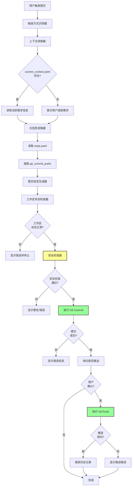
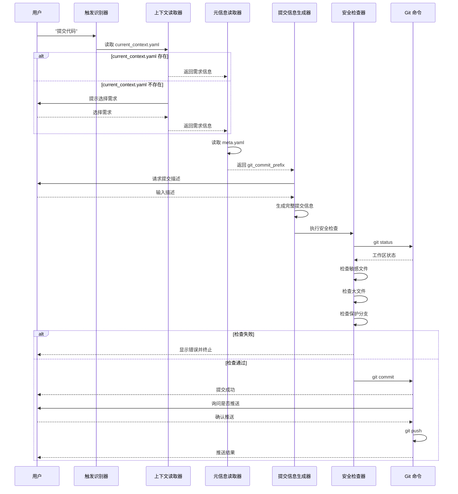

# 设计文档：Git 提交自动化联动

## 概述

Git 提交自动化联动功能是 Prompt 基座项目的增强功能，旨在实现 Git 提交与需求管理系统的无缝集成。该系统通过自动读取需求元信息（meta.yaml）和当前上下文（current_context.yaml），生成规范的提交信息，并在提交前执行全面的安全检查，确保代码提交的规范性、安全性和可追溯性。

### 设计目标

1. **自动化提交信息生成**：从需求元信息自动提取提交前缀，减少手动输入错误
2. **安全性保障**：提交前执行多层安全检查，防止敏感文件泄露和错误提交
3. **上下文感知**：与 current_context.yaml 集成，自动关联当前工作的需求
4. **用户友好**：提供清晰的交互提示和错误信息，支持多种触发方式
5. **可配置性**：通过配置文件灵活控制系统行为

### 核心理念

- **约定优于配置**：遵循标准的提交信息格式和文件路径约定
- **安全第一**：多层安全检查，宁可拒绝也不误提交
- **上下文驱动**：基于当前工作上下文自动推断提交信息
- **渐进式增强**：从基本功能开始，逐步增加高级特性

## 架构

### 系统架构图




### 数据流



### 层级结构

```
Git 提交自动化系统
├─ 触发层
│  └─ 触发方式识别器（识别用户意图）
├─ 上下文层
│  ├─ 上下文读取器（读取 current_context.yaml）
│  └─ 元信息读取器（读取 meta.yaml）
├─ 生成层
│  └─ 提交信息生成器（生成规范提交信息）
├─ 检查层
│  ├─ 工作区状态检查器（检查 Git 状态）
│  └─ 安全检查器（检查敏感文件、大文件、保护分支）
├─ 执行层
│  ├─ Git 提交执行器（执行 git commit）
│  └─ Git 推送执行器（执行 git push）
└─ 记录层
   └─ 历史记录管理器（记录提交历史）
```


## 组件和接口

### 组件 1：触发方式识别器（Trigger Recognizer）

**职责**：识别用户的提交意图，解析用户输入的关键词和参数

**输入**：
- 用户输入文本

**输出**：
- 触发类型（commit, commit_and_push）
- 提交描述（如果用户直接提供）

**识别规则**：
- 关键词：`提交代码`、`git 提交`、`commit`、`推送代码`、`git push`
- 支持直接指定描述：`提交代码: 实现某功能`

**伪代码**：

```python
def recognize_trigger(user_input: str) -> dict:
    """
    识别用户的提交意图
    
    Args:
        user_input: 用户输入文本
        
    Returns:
        {
            'trigger_type': 'commit' | 'commit_and_push' | None,
            'description': str | None
        }
    """
    # 规范化输入
    normalized = user_input.lower().strip()
    
    # 检查提交关键词
    commit_keywords = ['提交代码', 'git 提交', 'commit', '提交']
    push_keywords = ['推送代码', 'git push', 'push']
    
    trigger_type = None
    description = None
    
    # 检查推送关键词（优先级更高）
    for keyword in push_keywords:
        if keyword in normalized:
            trigger_type = 'commit_and_push'
            # 提取描述（冒号后的内容）
            if ':' in user_input:
                description = user_input.split(':', 1)[1].strip()
            break
    
    # 检查提交关键词
    if not trigger_type:
        for keyword in commit_keywords:
            if keyword in normalized:
                trigger_type = 'commit'
                # 提取描述
                if ':' in user_input:
                    description = user_input.split(':', 1)[1].strip()
                break
    
    return {
        'trigger_type': trigger_type,
        'description': description
    }
```

### 组件 2：上下文读取器（Context Reader）

**职责**：读取当前工作上下文，获取当前关联的需求信息

**输入**：
- current_context.yaml 文件路径

**输出**：
- 需求信息（模块名、版本号、主题）
- 或 None（如果文件不存在）

**错误处理**：
- 文件不存在 → 返回 None
- 格式错误 → 输出警告，返回 None

**伪代码**：

```python
def read_current_context(context_path: str = '.kiro/current_context.yaml') -> dict | None:
    """
    读取当前工作上下文
    
    Args:
        context_path: current_context.yaml 文件路径
        
    Returns:
        需求信息字典，或 None
    """
    try:
        with open(context_path, 'r', encoding='utf-8') as f:
            context = yaml.safe_load(f)
        
        # 提取需求信息
        active_req = context.get('active_requirement', {})
        
        if not active_req:
            log_warning("current_context.yaml 中缺少 active_requirement 字段")
            return None
        
        # 从路径中提取模块名和版本号
        req_path = active_req.get('path', '')
        # 路径格式：requirements/{module}/{version}/
        parts = req_path.strip('/').split('/')
        
        if len(parts) >= 3:
            module = parts[1]
            version = parts[2]
        else:
            log_warning(f"无法从路径解析模块信息: {req_path}")
            return None
        
        return {
            'module': module,
            'version': version,
            'topic': active_req.get('topic', ''),
            'status': active_req.get('status', '')
        }
    
    except FileNotFoundError:
        log_info("current_context.yaml 不存在")
        return None
    
    except yaml.YAMLError as e:
        log_warning(f"current_context.yaml 格式错误: {e}")
        return None
    
    except Exception as e:
        log_error(f"读取 current_context.yaml 失败: {e}")
        return None
```


### 组件 3：元信息读取器（Meta Reader）

**职责**：读取需求元信息文件，提取 git_commit_prefix

**输入**：
- 模块名
- 版本号

**输出**：
- git_commit_prefix（如 "feat(workflow-v1.0)"）
- 需求主题
- 其他元信息

**路径构建规则**：
```
requirements/{module}/{version}/meta.yaml
```

**伪代码**：

```python
def read_meta_info(module: str, version: str) -> dict | None:
    """
    读取需求元信息
    
    Args:
        module: 模块名
        version: 版本号
        
    Returns:
        元信息字典，或 None
    """
    meta_path = f'requirements/{module}/{version}/meta.yaml'
    
    try:
        with open(meta_path, 'r', encoding='utf-8') as f:
            meta = yaml.safe_load(f)
        
        # 验证必需字段
        if 'git_commit_prefix' not in meta:
            log_warning(f"meta.yaml 缺少 git_commit_prefix 字段: {meta_path}")
            return None
        
        return {
            'git_commit_prefix': meta['git_commit_prefix'],
            'theme': meta.get('theme', ''),
            'description': meta.get('description', ''),
            'status': meta.get('status', '')
        }
    
    except FileNotFoundError:
        log_error(f"meta.yaml 不存在: {meta_path}")
        return None
    
    except yaml.YAMLError as e:
        log_error(f"meta.yaml 格式错误: {meta_path}, 错误: {e}")
        return None
    
    except Exception as e:
        log_error(f"读取 meta.yaml 失败: {meta_path}, 错误: {e}")
        return None
```

### 组件 4：提交信息生成器（Commit Message Generator）

**职责**：根据提交前缀和用户描述生成规范的提交信息

**输入**：
- git_commit_prefix（如 "feat(workflow-v1.0)"）
- 用户提交描述

**输出**：
- 完整的提交信息（标题 + 详细描述）

**生成规则**：
- 格式：`{prefix}: {description}`
- 标题不超过 72 个字符
- 多行描述：标题和详细描述之间插入空行

**伪代码**：

```python
def generate_commit_message(prefix: str, description: str) -> str:
    """
    生成规范的提交信息
    
    Args:
        prefix: 提交前缀（如 "feat(workflow-v1.0)"）
        description: 用户提交描述
        
    Returns:
        完整的提交信息
    """
    # 分割标题和详细描述
    lines = description.strip().split('\n')
    title_line = lines[0].strip()
    detail_lines = [line.strip() for line in lines[1:] if line.strip()]
    
    # 生成标题
    title = f"{prefix}: {title_line}"
    
    # 检查标题长度
    if len(title) > 72:
        # 截断并添加省略号
        title = title[:69] + "..."
        log_warning(f"提交标题过长，已截断: {title}")
    
    # 组合完整提交信息
    if detail_lines:
        # 有详细描述
        commit_message = title + "\n\n" + "\n".join(detail_lines)
    else:
        # 只有标题
        commit_message = title
    
    return commit_message
```


### 组件 5：工作区状态检查器（Workspace Status Checker）

**职责**：检查 Git 工作区状态，确保可以安全提交

**输入**：
- 工作区路径

**输出**：
- 检查结果（通过/失败）
- 错误信息列表

**检查项**：
1. 是否为 Git 仓库
2. 是否有暂存的文件
3. 是否有未解决的合并冲突
4. 是否处于 detached HEAD 状态

**伪代码**：

```python
def check_workspace_status(workspace_path: str = '.') -> dict:
    """
    检查工作区状态
    
    Args:
        workspace_path: 工作区路径
        
    Returns:
        {
            'passed': bool,
            'errors': list[str],
            'warnings': list[str],
            'staged_files': list[str]
        }
    """
    errors = []
    warnings = []
    staged_files = []
    
    # 检查是否为 Git 仓库
    result = run_command(['git', 'rev-parse', '--git-dir'], cwd=workspace_path)
    if result.returncode != 0:
        errors.append("当前目录不是 Git 仓库")
        return {'passed': False, 'errors': errors, 'warnings': warnings, 'staged_files': []}
    
    # 检查是否有暂存的文件
    result = run_command(['git', 'diff', '--cached', '--name-only'], cwd=workspace_path)
    if result.returncode == 0:
        staged_files = [f.strip() for f in result.stdout.split('\n') if f.strip()]
        
        if not staged_files:
            errors.append("没有暂存的文件，请先使用 'git add' 暂存文件")
            return {'passed': False, 'errors': errors, 'warnings': warnings, 'staged_files': []}
    
    # 检查是否有未解决的合并冲突
    result = run_command(['git', 'diff', '--name-only', '--diff-filter=U'], cwd=workspace_path)
    if result.returncode == 0:
        conflict_files = [f.strip() for f in result.stdout.split('\n') if f.strip()]
        if conflict_files:
            errors.append(f"存在未解决的合并冲突: {', '.join(conflict_files)}")
            return {'passed': False, 'errors': errors, 'warnings': warnings, 'staged_files': staged_files}
    
    # 检查是否处于 detached HEAD 状态
    result = run_command(['git', 'symbolic-ref', '-q', 'HEAD'], cwd=workspace_path)
    if result.returncode != 0:
        warnings.append("当前处于 detached HEAD 状态，提交后可能丢失")
    
    return {
        'passed': True,
        'errors': errors,
        'warnings': warnings,
        'staged_files': staged_files
    }


def run_command(cmd: list[str], cwd: str = '.') -> subprocess.CompletedProcess:
    """
    执行命令
    
    Args:
        cmd: 命令列表
        cwd: 工作目录
        
    Returns:
        命令执行结果
    """
    return subprocess.run(
        cmd,
        cwd=cwd,
        capture_output=True,
        text=True,
        encoding='utf-8'
    )
```

### 组件 6：安全检查器（Security Checker）

**职责**：执行安全检查，防止提交敏感文件和大文件

**输入**：
- 暂存文件列表
- 配置（敏感文件模式、大文件阈值、保护分支列表）

**输出**：
- 检查结果（通过/失败）
- 阻止性问题列表
- 警告列表

**检查项**：
1. 敏感文件检测
2. 大文件检测
3. 保护分支检测

**实现**：
- 复用现有的 `security_checker.py` 模块
- 调用 `SecurityChecker.check_all()` 方法

**伪代码**：

```python
from security_checker import SecurityChecker

def perform_security_check(staged_files: list[str], config: dict) -> dict:
    """
    执行安全检查
    
    Args:
        staged_files: 暂存文件列表
        config: 配置字典
        
    Returns:
        {
            'passed': bool,
            'blocking_issues': list[str],
            'warnings': list[str],
            'details': dict
        }
    """
    # 创建安全检查器
    checker = SecurityChecker(workspace_root='.', config=config)
    
    # 执行所有检查
    check_results = checker.check_all(staged_files)
    
    # 检查阻止性问题
    has_blocking, blocking_issues = checker.has_blocking_issues(check_results)
    
    # 检查警告
    has_warnings, warnings = checker.has_warnings(check_results)
    
    return {
        'passed': not has_blocking,
        'blocking_issues': blocking_issues,
        'warnings': warnings,
        'details': check_results
    }
```


### 组件 7：Git 提交执行器（Git Commit Executor）

**职责**：执行 Git 提交操作

**输入**：
- 提交信息
- 工作区路径

**输出**：
- 执行结果（成功/失败）
- 提交哈希（如果成功）
- 错误信息（如果失败）

**伪代码**：

```python
def execute_commit(commit_message: str, workspace_path: str = '.') -> dict:
    """
    执行 Git 提交
    
    Args:
        commit_message: 提交信息
        workspace_path: 工作区路径
        
    Returns:
        {
            'success': bool,
            'commit_hash': str | None,
            'error': str | None
        }
    """
    try:
        # 执行 git commit
        result = run_command(
            ['git', 'commit', '-m', commit_message],
            cwd=workspace_path
        )
        
        if result.returncode != 0:
            return {
                'success': False,
                'commit_hash': None,
                'error': result.stderr
            }
        
        # 获取提交哈希
        result = run_command(['git', 'rev-parse', 'HEAD'], cwd=workspace_path)
        commit_hash = result.stdout.strip() if result.returncode == 0 else None
        
        return {
            'success': True,
            'commit_hash': commit_hash,
            'error': None
        }
    
    except Exception as e:
        return {
            'success': False,
            'commit_hash': None,
            'error': str(e)
        }
```

### 组件 8：Git 推送执行器（Git Push Executor）

**职责**：执行 Git 推送操作

**输入**：
- 工作区路径
- 远程名称（默认 origin）
- 分支名称（当前分支）

**输出**：
- 执行结果（成功/失败）
- 错误信息（如果失败）

**伪代码**：

```python
def execute_push(workspace_path: str = '.', remote: str = 'origin') -> dict:
    """
    执行 Git 推送
    
    Args:
        workspace_path: 工作区路径
        remote: 远程名称
        
    Returns:
        {
            'success': bool,
            'error': str | None,
            'error_type': str | None  # 'no_upstream' | 'behind' | 'other'
        }
    """
    try:
        # 获取当前分支名
        result = run_command(['git', 'rev-parse', '--abbrev-ref', 'HEAD'], cwd=workspace_path)
        if result.returncode != 0:
            return {
                'success': False,
                'error': '无法获取当前分支名',
                'error_type': 'other'
            }
        
        branch = result.stdout.strip()
        
        # 执行 git push
        result = run_command(['git', 'push', remote, branch], cwd=workspace_path)
        
        if result.returncode != 0:
            error_msg = result.stderr
            
            # 判断错误类型
            if 'has no upstream branch' in error_msg or 'set-upstream' in error_msg:
                error_type = 'no_upstream'
            elif 'rejected' in error_msg and 'non-fast-forward' in error_msg:
                error_type = 'behind'
            else:
                error_type = 'other'
            
            return {
                'success': False,
                'error': error_msg,
                'error_type': error_type
            }
        
        return {
            'success': True,
            'error': None,
            'error_type': None
        }
    
    except Exception as e:
        return {
            'success': False,
            'error': str(e),
            'error_type': 'other'
        }
```

### 组件 9：历史记录管理器（History Manager）

**职责**：记录提交历史，支持快速重用

**输入**：
- 提交信息
- 提交哈希
- 分支名称
- 时间戳

**输出**：
- 无（写入历史文件）

**存储格式**：
```yaml
# .kiro/commit_history.yaml
history:
  - timestamp: "2026-03-03 10:30:00"
    branch: "main"
    commit_hash: "abc123..."
    commit_message: "feat(workflow-v1.0): 实现动态模块加载器"
  - ...
```

**伪代码**：

```python
def save_commit_history(
    commit_message: str,
    commit_hash: str,
    branch: str,
    history_path: str = '.kiro/commit_history.yaml'
) -> None:
    """
    保存提交历史
    
    Args:
        commit_message: 提交信息
        commit_hash: 提交哈希
        branch: 分支名称
        history_path: 历史文件路径
    """
    from datetime import datetime
    
    # 读取现有历史
    try:
        with open(history_path, 'r', encoding='utf-8') as f:
            data = yaml.safe_load(f) or {}
    except FileNotFoundError:
        data = {}
    
    history = data.get('history', [])
    
    # 添加新记录
    history.insert(0, {
        'timestamp': datetime.now().strftime('%Y-%m-%d %H:%M:%S'),
        'branch': branch,
        'commit_hash': commit_hash,
        'commit_message': commit_message
    })
    
    # 保留最近 10 条
    history = history[:10]
    
    # 写入文件
    data['history'] = history
    with open(history_path, 'w', encoding='utf-8') as f:
        yaml.dump(data, f, allow_unicode=True, default_flow_style=False)


def get_commit_history(history_path: str = '.kiro/commit_history.yaml') -> list[dict]:
    """
    获取提交历史
    
    Args:
        history_path: 历史文件路径
        
    Returns:
        历史记录列表
    """
    try:
        with open(history_path, 'r', encoding='utf-8') as f:
            data = yaml.safe_load(f) or {}
        return data.get('history', [])
    except FileNotFoundError:
        return []
```

### 组件 10：配置管理器（Config Manager）

**职责**：读取和管理配置

**输入**：
- 配置文件路径

**输出**：
- 配置对象

**配置项**：
- 提交信息模板
- 是否自动推送
- 安全检查配置（敏感文件模式、大文件阈值、保护分支）

**伪代码**：

```python
def load_config(config_path: str = '.kiro/modules/git-commit/v1.0/config.yaml') -> dict:
    """
    加载配置
    
    Args:
        config_path: 配置文件路径
        
    Returns:
        配置字典
    """
    # 默认配置
    default_config = {
        'commit_message': {
            'template': '{prefix}: {description}',
            'auto_prefix': True,
            'default_prefix': 'chore'
        },
        'requirement_meta': {
            'path_template': 'requirements/{module}/{version}/meta.yaml',
            'required': False
        },
        'pre_commit': {
            'check_clean': True,
            'check_staged': True,
            'run_tests': False
        },
        'post_commit': {
            'auto_push': False,
            'update_meta_status': False
        },
        'security': {
            'sensitive_patterns': [],
            'warn_size_mb': 10,
            'block_size_mb': 100,
            'protected_branches': ['main', 'master', 'production']
        }
    }
    
    try:
        with open(config_path, 'r', encoding='utf-8') as f:
            user_config = yaml.safe_load(f) or {}
        
        # 合并配置（用户配置覆盖默认配置）
        config = deep_merge(default_config, user_config)
        return config
    
    except FileNotFoundError:
        log_info(f"配置文件不存在，使用默认配置: {config_path}")
        return default_config
    
    except yaml.YAMLError as e:
        log_warning(f"配置文件格式错误，使用默认配置: {config_path}, 错误: {e}")
        return default_config


def deep_merge(base: dict, override: dict) -> dict:
    """
    深度合并字典
    
    Args:
        base: 基础字典
        override: 覆盖字典
        
    Returns:
        合并后的字典
    """
    result = base.copy()
    
    for key, value in override.items():
        if key in result and isinstance(result[key], dict) and isinstance(value, dict):
            result[key] = deep_merge(result[key], value)
        else:
            result[key] = value
    
    return result
```


## 数据模型

### 当前上下文模型（Current Context）

```yaml
# .kiro/current_context.yaml

# 当前活跃需求信息
active_requirement:
  path: "requirements/git-commit-automation/v1.0/"
  topic: "Git 提交自动化联动"
  version: "v1.0"
  status: "开发中"

# 当前工作环境
environment:
  current_directory: "/path/to/project"
  current_file: "design.md"
  current_file_type: ".md"

# 更新时间
updated_at: "2026-03-03 10:30:00"
```

### 需求元信息模型（Requirement Meta）

```yaml
# requirements/{module}/{version}/meta.yaml

theme: Git 提交自动化联动
module: git-commit-automation
version: v1.0
author: yangzhuo
date: 2026-03-03
status: 开发中
description: 实现 Git 提交与需求主题关联，自动从 meta.yaml 读取提交前缀生成规范提交信息
git_commit_prefix: feat(git-commit-automation-v1.0)
```

### 提交历史模型（Commit History）

```yaml
# .kiro/commit_history.yaml

history:
  - timestamp: "2026-03-03 10:30:00"
    branch: "main"
    commit_hash: "abc123def456..."
    commit_message: "feat(workflow-v1.0): 实现动态模块加载器"
  
  - timestamp: "2026-03-03 09:15:00"
    branch: "feature/git-commit"
    commit_hash: "def456abc123..."
    commit_message: "feat(git-commit-v1.0): 添加安全检查功能"
  
  # ... 最多保留 10 条
```

### 配置模型（Config）

```yaml
# .kiro/modules/git-commit/v1.0/config.yaml

# 提交信息格式
commit_message:
  template: "{prefix}: {description}"
  auto_prefix: true
  default_prefix: "chore"

# 需求元信息路径
requirement_meta:
  path_template: "requirements/{module}/{version}/meta.yaml"
  required: false

# 提交前检查
pre_commit:
  check_clean: true
  check_staged: true
  run_tests: false

# 提交后操作
post_commit:
  auto_push: false
  update_meta_status: false

# 安全检查配置
security:
  # 敏感文件模式（追加到默认模式）
  sensitive_patterns:
    - "*.secret"
    - "**/private/*"
  
  # 大文件阈值
  warn_size_mb: 10
  block_size_mb: 100
  
  # 保护分支
  protected_branches:
    - "main"
    - "master"
    - "production"
```

### 安全检查结果模型（Security Check Result）

```python
{
    # 敏感文件列表
    'sensitive_files': [
        {
            'file': 'config/.env',
            'matched_pattern': '*.env',
            'risk_level': 'high'
        }
    ],
    
    # 大文件列表
    'large_files': [
        {
            'file': 'data/large_dataset.csv',
            'size_mb': 15.5,
            'level': 'warning'  # 'warning' 或 'block'
        }
    ],
    
    # 保护分支检测
    'is_protected': True,
    'current_branch': 'main',
    'protected_branches': ['main', 'master', 'production']
}
```


## 正确性属性

*属性是一个特征或行为，应该在系统的所有有效执行中保持为真——本质上是关于系统应该做什么的正式陈述。属性作为人类可读规范和机器可验证正确性保证之间的桥梁。*

### 属性 1：上下文文件读取正确性

*对于任意*存在的 current_context.yaml 文件，系统读取后应该正确提取模块名称和版本号，且提取的信息与文件内容完全一致。

**验证需求**：需求 1.1, 1.2, 6.1

### 属性 2：元信息路径构建正确性

*对于任意*模块名称和版本号，系统构建的 meta.yaml 路径应该符合模板 `requirements/{module}/{version}/meta.yaml`。

**验证需求**：需求 1.3

### 属性 3：提交前缀提取正确性

*对于任意*包含 git_commit_prefix 字段的 meta.yaml 文件，系统应该正确提取该字段的值，且提取的值与文件中的值完全一致。

**验证需求**：需求 1.4, 1.6

### 属性 4：提交信息格式正确性

*对于任意*提交前缀和用户描述，生成的提交信息应该符合模板 `{prefix}: {description}`，且标题不超过 72 个字符。

**验证需求**：需求 2.1, 2.3

### 属性 5：多行描述处理正确性

*对于任意*包含多行的提交描述，系统应该将第一行作为标题，其余行作为详细描述，且标题和详细描述之间有空行。

**验证需求**：需求 2.2, 2.5

### 属性 6：标题截断正确性

*对于任意*超过 72 个字符的提交标题，系统应该截断至 69 个字符并添加 "..."，使最终长度不超过 72 个字符。

**验证需求**：需求 2.4

### 属性 7：敏感文件检测正确性

*对于任意*文件列表，如果列表中包含匹配敏感文件模式的文件，系统应该检测出所有敏感文件并阻止提交。

**验证需求**：需求 3.2

### 属性 8：大文件阻止正确性

*对于任意*文件列表，如果列表中包含超过阻止阈值的文件，系统应该检测出所有超大文件并阻止提交。

**验证需求**：需求 3.3

### 属性 9：大文件警告正确性

*对于任意*文件列表，如果列表中包含超过警告阈值但未超过阻止阈值的文件，系统应该显示警告但允许继续提交。

**验证需求**：需求 3.4

### 属性 10：保护分支警告正确性

*对于任意*分支名称，如果该分支在保护分支列表中，系统应该显示警告并要求用户确认。

**验证需求**：需求 3.5

### 属性 11：安全检查阻止正确性

*对于任意*安全检查结果，如果存在阻止性问题（敏感文件或超大文件），系统应该终止提交流程。

**验证需求**：需求 3.6

### 属性 12：安全检查通过正确性

*对于任意*安全检查结果，如果所有检查都通过（无敏感文件、无超大文件、或用户确认了警告），系统应该继续执行提交操作。

**验证需求**：需求 3.7

### 属性 13：暂存文件检测正确性

*对于任意*Git 工作区，系统应该正确检测是否有暂存的文件，且检测结果与 `git diff --cached --name-only` 的输出一致。

**验证需求**：需求 4.3

### 属性 14：推送错误类型识别正确性

*对于任意*推送失败的错误信息，系统应该正确识别错误类型（no_upstream、behind、other），并提供相应的解决建议。

**验证需求**：需求 5.4, 5.5, 5.6

### 属性 15：自动推送配置应用正确性

*对于任意*配置，当 auto_push 设置为 true 时，系统应该跳过询问直接推送；当设置为 false 时，系统应该询问用户。

**验证需求**：需求 5.7

### 属性 16：上下文文件写入一致性（Round-trip）

*对于任意*需求信息，将其写入 current_context.yaml 后再读取，应该得到完全相同的需求信息。

**验证需求**：需求 6.4

### 属性 17：状态更新配置应用正确性

*对于任意*配置，当 update_meta_status 设置为 true 时，系统应该自动更新状态；当设置为 false 时，系统应该询问用户。

**验证需求**：需求 6.6

### 属性 18：错误信息完整性

*对于任意*错误场景，系统显示的错误信息应该包含错误类型和具体原因。

**验证需求**：需求 7.2

### 属性 19：警告信息标注正确性

*对于任意*警告场景，系统显示的警告信息应该明确标注为"警告"并说明影响。

**验证需求**：需求 7.3

### 属性 20：成功消息完整性

*对于任意*成功的提交操作，系统显示的成功消息应该包含提交哈希。

**验证需求**：需求 7.5

### 属性 21：历史记录保存正确性

*对于任意*成功的提交，系统应该将提交信息（包含时间戳、分支名、提交哈希、提交消息）保存到历史记录文件。

**验证需求**：需求 8.1, 8.5

### 属性 22：历史记录长度限制正确性

*对于任意*历史记录文件，无论添加多少条记录，文件中应该始终只保留最近 10 条记录。

**验证需求**：需求 8.2

### 属性 23：历史信息填充正确性

*对于任意*从历史记录中选择的提交信息，系统应该将其完整地填充到当前提交描述中。

**验证需求**：需求 8.4

### 属性 24：配置读取正确性

*对于任意*有效的配置文件，系统读取后应该正确提取所有配置项，且提取的值与文件内容完全一致。

**验证需求**：需求 9.1

### 属性 25：配置项应用正确性

*对于任意*配置（提交信息模板、auto_push、安全检查阈值、保护分支列表），系统的行为应该与配置的值一致。

**验证需求**：需求 9.3, 9.4, 9.5, 9.6

### 属性 26：提交关键词识别正确性

*对于任意*包含提交关键词（"提交代码"、"git 提交"、"commit"）的用户输入，系统应该识别为提交触发，且触发类型为 'commit'。

**验证需求**：需求 10.1, 10.2, 10.3

### 属性 27：推送关键词识别正确性

*对于任意*包含推送关键词（"推送代码"、"git push"）的用户输入，系统应该识别为推送触发，且触发类型为 'commit_and_push'。

**验证需求**：需求 10.4, 10.5

### 属性 28：提交描述提取正确性

*对于任意*包含冒号的用户输入（格式：`关键词: 描述`），系统应该正确提取冒号后的内容作为提交描述。

**验证需求**：需求 10.6, 10.7


## 错误处理

### 错误类型和处理策略

| 错误类型 | 触发条件 | 处理策略 | 影响范围 |
|---------|---------|---------|---------|
| current_context.yaml 不存在 | 文件不存在 | 提示用户选择/输入需求信息 | 降级处理 |
| current_context.yaml 格式错误 | YAML 解析失败 | 输出警告，提示用户选择/输入需求信息 | 降级处理 |
| meta.yaml 不存在 | 文件不存在 | 输出错误，提示用户手动输入提交前缀 | 降级处理 |
| meta.yaml 格式错误 | YAML 解析失败 | 输出错误，提示用户手动输入提交前缀 | 降级处理 |
| meta.yaml 缺少 git_commit_prefix | 字段不存在 | 输出警告，使用默认前缀或提示用户输入 | 降级处理 |
| 不是 Git 仓库 | git rev-parse 失败 | 输出错误，终止操作 | 全局（无法提交） |
| 没有暂存文件 | git diff --cached 为空 | 输出错误，提示用户先暂存文件 | 全局（无法提交） |
| 存在合并冲突 | git diff --diff-filter=U 有输出 | 输出错误，提示用户解决冲突 | 全局（无法提交） |
| detached HEAD 状态 | git symbolic-ref 失败 | 输出警告，要求用户确认 | 警告 |
| 检测到敏感文件 | 安全检查失败 | 输出错误，列出敏感文件，阻止提交 | 全局（无法提交） |
| 检测到超大文件 | 文件大小超过阻止阈值 | 输出错误，列出大文件，阻止提交 | 全局（无法提交） |
| 检测到大文件（警告） | 文件大小超过警告阈值 | 输出警告，允许继续 | 警告 |
| 保护分支 | 当前分支在保护列表中 | 输出警告，要求用户确认 | 警告 |
| Git commit 失败 | git commit 返回非零 | 输出错误信息，终止操作 | 全局（提交失败） |
| Git push 失败（no upstream） | 远程分支不存在 | 输出错误，提示使用 --set-upstream | 推送失败 |
| Git push 失败（behind） | 本地落后于远程 | 输出错误，提示先拉取远程更改 | 推送失败 |
| Git push 失败（other） | 其他推送错误 | 输出错误信息 | 推送失败 |
| 配置文件不存在 | 文件不存在 | 使用默认配置 | 降级处理 |
| 配置文件格式错误 | YAML 解析失败 | 输出警告，使用默认配置 | 降级处理 |
| 历史记录文件读取失败 | 文件不存在或格式错误 | 返回空列表 | 降级处理 |

### 错误恢复机制

1. **降级处理**：当配置文件或上下文文件不可用时，使用默认值或提示用户输入
2. **清晰的错误信息**：所有错误都应该输出清晰的错误信息，包含错误类型、具体原因和解决建议
3. **阻止性错误**：对于可能导致数据丢失或安全问题的错误（敏感文件、超大文件、合并冲突），直接阻止操作
4. **警告性错误**：对于可能有风险但不致命的情况（大文件警告、保护分支、detached HEAD），显示警告并要求用户确认

### 错误日志格式

```
[ERROR] [GitCommit] 错误类型: 具体错误信息
[WARNING] [GitCommit] 警告类型: 具体警告信息
[INFO] [GitCommit] 信息类型: 具体信息内容
```

示例：
```
[ERROR] [GitCommit] meta.yaml 不存在: requirements/git-commit-automation/v1.0/meta.yaml
[WARNING] [GitCommit] 检测到大文件: data/large_dataset.csv (15.5 MB)
[WARNING] [GitCommit] 当前分支 'main' 是保护分支，请确认是否继续提交
[INFO] [GitCommit] 提交成功: abc123def456...
```


## 测试策略

### 双重测试方法

本项目采用**单元测试**和**基于属性的测试**相结合的方法，确保全面的测试覆盖。

#### 单元测试

单元测试用于验证特定示例、边界情况和错误条件。单元测试应该聚焦于：
- 特定示例：演示正确行为的具体案例
- 集成点：组件之间的交互
- 边界情况：空输入、特殊字符、极端值
- 错误条件：文件不存在、格式错误、权限问题

**测试场景**：

1. **上下文读取**：
   - 示例：读取标准格式的 current_context.yaml
   - 边界：文件不存在、格式错误、缺少字段
   - 错误：权限问题、路径解析失败

2. **元信息读取**：
   - 示例：读取标准格式的 meta.yaml
   - 边界：文件不存在、缺少 git_commit_prefix 字段
   - 错误：YAML 格式错误

3. **提交信息生成**：
   - 示例：标准前缀 + 单行描述
   - 示例：标准前缀 + 多行描述
   - 边界：超长标题（需要截断）
   - 边界：空描述

4. **工作区状态检查**：
   - 示例：正常的 Git 仓库，有暂存文件
   - 边界：不是 Git 仓库
   - 边界：没有暂存文件
   - 边界：存在合并冲突
   - 边界：detached HEAD 状态

5. **安全检查**：
   - 示例：无敏感文件、无大文件
   - 示例：包含敏感文件（应阻止）
   - 示例：包含超大文件（应阻止）
   - 示例：包含警告级别大文件（应警告）
   - 示例：在保护分支上（应警告）

6. **触发方式识别**：
   - 示例：识别"提交代码"
   - 示例：识别"推送代码"
   - 示例：提取提交描述："提交代码: 实现某功能"
   - 边界：不包含关键词的输入

#### 基于属性的测试

基于属性的测试用于验证系统在所有可能输入下的正确性。属性测试应该覆盖通用规则和不变量。

**测试配置**：
- 每个属性测试运行 **最少 100 次迭代**
- 使用随机生成的输入数据
- 每个测试标记为：`Feature: git-commit-automation, Property {number}: {property_text}`

**属性测试列表**：

1. **属性 1：上下文文件读取正确性**
   - 生成器：随机生成包含需求信息的 YAML 内容
   - 验证：读取后提取的模块名和版本号与原始内容一致

2. **属性 2：元信息路径构建正确性**
   - 生成器：随机生成模块名和版本号
   - 验证：构建的路径符合模板

3. **属性 3：提交前缀提取正确性**
   - 生成器：随机生成包含 git_commit_prefix 的 YAML 内容
   - 验证：提取的值与原始值一致

4. **属性 4：提交信息格式正确性**
   - 生成器：随机生成前缀和描述
   - 验证：生成的提交信息符合模板，标题不超过 72 字符

5. **属性 5：多行描述处理正确性**
   - 生成器：随机生成多行描述
   - 验证：第一行为标题，其余为详细描述，中间有空行

6. **属性 6：标题截断正确性**
   - 生成器：随机生成超长标题
   - 验证：截断后长度不超过 72 字符，末尾为 "..."

7. **属性 7：敏感文件检测正确性**
   - 生成器：随机生成文件列表，部分匹配敏感模式
   - 验证：所有敏感文件都被检测出

8. **属性 8：大文件阻止正确性**
   - 生成器：随机生成文件列表和大小
   - 验证：超过阻止阈值的文件被检测并阻止提交

9. **属性 9：大文件警告正确性**
   - 生成器：随机生成文件列表和大小
   - 验证：超过警告阈值但未超过阻止阈值的文件显示警告

10. **属性 10：保护分支警告正确性**
    - 生成器：随机生成分支名称和保护分支列表
    - 验证：保护分支显示警告

11. **属性 11：安全检查阻止正确性**
    - 生成器：随机生成包含阻止性问题的检查结果
    - 验证：系统终止提交流程

12. **属性 12：安全检查通过正确性**
    - 生成器：随机生成无阻止性问题的检查结果
    - 验证：系统继续提交流程

13. **属性 13：暂存文件检测正确性**
    - 生成器：模拟 git diff --cached 输出
    - 验证：检测结果与输出一致

14. **属性 14：推送错误类型识别正确性**
    - 生成器：随机生成各种推送错误信息
    - 验证：正确识别错误类型

15. **属性 15：自动推送配置应用正确性**
    - 生成器：随机生成 auto_push 配置
    - 验证：系统行为与配置一致

16. **属性 16：上下文文件写入一致性（Round-trip）**
    - 生成器：随机生成需求信息
    - 验证：写入后读取的内容与原始内容一致

17. **属性 17：状态更新配置应用正确性**
    - 生成器：随机生成 update_meta_status 配置
    - 验证：系统行为与配置一致

18. **属性 18：错误信息完整性**
    - 生成器：随机生成各种错误场景
    - 验证：错误信息包含类型和原因

19. **属性 19：警告信息标注正确性**
    - 生成器：随机生成各种警告场景
    - 验证：警告信息明确标注为"警告"

20. **属性 20：成功消息完整性**
    - 生成器：随机生成提交哈希
    - 验证：成功消息包含提交哈希

21. **属性 21：历史记录保存正确性**
    - 生成器：随机生成提交信息
    - 验证：历史记录包含所有必需字段

22. **属性 22：历史记录长度限制正确性**
    - 生成器：添加超过 10 条记录
    - 验证：只保留最近 10 条

23. **属性 23：历史信息填充正确性**
    - 生成器：随机选择历史记录
    - 验证：填充的内容与历史记录一致

24. **属性 24：配置读取正确性**
    - 生成器：随机生成配置文件内容
    - 验证：读取的配置与文件内容一致

25. **属性 25：配置项应用正确性**
    - 生成器：随机生成各种配置项
    - 验证：系统行为与配置一致

26. **属性 26：提交关键词识别正确性**
    - 生成器：随机生成包含提交关键词的输入
    - 验证：识别为 'commit' 触发类型

27. **属性 27：推送关键词识别正确性**
    - 生成器：随机生成包含推送关键词的输入
    - 验证：识别为 'commit_and_push' 触发类型

28. **属性 28：提交描述提取正确性**
    - 生成器：随机生成包含冒号的输入
    - 验证：正确提取冒号后的描述

### 测试工具选择

**Python 项目**（如果实现为 Python 脚本）：
- 单元测试：pytest
- 属性测试：Hypothesis
- 配置：每个属性测试至少 100 次迭代

**Prompt 工程项目**（如果实现为 Prompt）：
- 手动验证测试：创建测试场景和预期结果文档
- 配置文件测试套件：创建多个测试配置文件
- 集成测试：测试与 Kiro AI 的集成

### 测试覆盖目标

- 单元测试覆盖率：80% 以上
- 属性测试覆盖：所有 28 个正确性属性
- 边界情况覆盖：所有已识别的边界情况
- 错误处理覆盖：所有错误类型


## 实现注意事项

### 实现方式选择

本功能可以采用两种实现方式：

#### 方式 1：Prompt 工程实现

将逻辑嵌入到 `.kiro/modules/git-commit/v1.0/steering/git_commit.md` 中，由 Kiro AI 解释执行。

**优点**：
- 无需编写代码，快速实现
- 易于修改和调整
- 与 Kiro 系统无缝集成

**缺点**：
- 依赖 AI 的理解和执行能力
- 难以进行自动化测试
- 性能可能不如代码实现

**适用场景**：
- 快速原型验证
- 功能迭代阶段
- 对性能要求不高的场景

#### 方式 2：Python 脚本实现

编写 Python 脚本实现核心逻辑，Prompt 负责调用脚本。

**优点**：
- 逻辑清晰，易于测试
- 性能更好
- 可以进行单元测试和属性测试

**缺点**：
- 需要编写和维护代码
- 需要处理跨平台兼容性

**适用场景**：
- 生产环境部署
- 需要高性能的场景
- 需要严格测试的场景

**推荐方案**：采用**混合方式**
- 核心逻辑（文件读取、安全检查、Git 命令执行）使用 Python 脚本
- 用户交互和流程控制使用 Prompt
- 复用现有的 `security_checker.py` 模块

### Prompt 工程实现要点

如果采用 Prompt 工程实现，需要在 Steering 文件中明确描述：

1. **触发条件**：
   ```markdown
   当用户说"提交代码"、"git 提交"、"commit"等关键词时，触发 Git 提交流程。
   ```

2. **执行步骤**：
   ```markdown
   1. 读取 .kiro/current_context.yaml，获取当前需求信息
   2. 如果文件不存在，询问用户选择需求
   3. 根据需求信息读取 requirements/{module}/{version}/meta.yaml
   4. 提取 git_commit_prefix 字段
   5. 询问用户输入提交描述
   6. 生成完整提交信息：{prefix}: {description}
   7. 执行安全检查（调用 security_checker.py）
   8. 如果检查通过，执行 git commit
   9. 询问用户是否推送
   10. 如果确认，执行 git push
   ```

3. **错误处理**：
   ```markdown
   - 如果 current_context.yaml 不存在，提示用户选择需求
   - 如果 meta.yaml 不存在，提示用户手动输入提交前缀
   - 如果安全检查失败，列出问题并阻止提交
   - 如果 git commit 失败，显示错误信息
   - 如果 git push 失败，根据错误类型提供解决建议
   ```

### Python 脚本实现要点

如果采用 Python 脚本实现，需要创建以下脚本：

1. **主脚本**：`.kiro/modules/git-commit/v1.0/scripts/git_commit.py`
   - 实现完整的提交流程
   - 调用各个组件
   - 处理用户交互

2. **组件脚本**：
   - `context_reader.py`：读取 current_context.yaml
   - `meta_reader.py`：读取 meta.yaml
   - `commit_generator.py`：生成提交信息
   - `workspace_checker.py`：检查工作区状态
   - `git_executor.py`：执行 Git 命令
   - `history_manager.py`：管理提交历史
   - `config_manager.py`：管理配置

3. **复用现有模块**：
   - `security_checker.py`：已存在，直接复用

### 与现有模块的集成

1. **与 workflow 模块集成**：
   - 在 VibCoding 工作流中，完成需求开发后，自动更新 current_context.yaml
   - 提供"提交代码"选项，触发 Git 提交流程

2. **与 doc-save 模块集成**：
   - 提交前自动保存文档
   - 确保文档和代码同步提交

3. **与 ai-dev 模块集成**：
   - 在 AI 开发流程中，自动触发提交
   - 根据开发任务自动生成提交描述

### 配置文件管理

配置文件位置：`.kiro/modules/git-commit/v1.0/config.yaml`

**配置项说明**：
- `commit_message.template`：提交信息模板
- `commit_message.auto_prefix`：是否自动读取前缀
- `commit_message.default_prefix`：默认前缀
- `requirement_meta.path_template`：meta.yaml 路径模板
- `requirement_meta.required`：是否必须存在 meta.yaml
- `pre_commit.check_clean`：是否检查工作区干净
- `pre_commit.check_staged`：是否检查暂存文件
- `pre_commit.run_tests`：是否运行测试
- `post_commit.auto_push`：是否自动推送
- `post_commit.update_meta_status`：是否更新 meta.yaml 状态
- `security.*`：安全检查配置

### 用户交互设计

**交互流程**：
1. 用户触发：`提交代码` 或 `提交代码: 实现某功能`
2. 系统响应：
   ```
   [INFO] 读取当前需求上下文...
   [INFO] 当前需求：Git 提交自动化联动 (git-commit-automation v1.0)
   [INFO] 提交前缀：feat(git-commit-automation-v1.0)
   ```
3. 如果用户未提供描述，询问：
   ```
   请输入提交描述：
   ```
4. 执行安全检查：
   ```
   [INFO] 执行安全检查...
   [INFO] 检查暂存文件: 5 个文件
   [INFO] 检查敏感文件: 通过
   [INFO] 检查大文件: 通过
   [INFO] 检查保护分支: 通过
   ```
5. 执行提交：
   ```
   [INFO] 执行提交...
   [INFO] 提交成功: abc123def456...
   ```
6. 询问是否推送：
   ```
   是否推送到远程仓库？(y/n)
   ```
7. 执行推送：
   ```
   [INFO] 推送到远程...
   [INFO] 推送成功
   ```

**错误提示示例**：
```
[ERROR] 检测到敏感文件:
  - config/.env (匹配模式: *.env)
  - keys/private.key (匹配模式: *.key)
提交已阻止，请移除敏感文件后重试。
```

```
[WARNING] 检测到大文件:
  - data/large_dataset.csv (15.5 MB)
建议使用 Git LFS 管理大文件。是否继续提交？(y/n)
```

```
[WARNING] 当前分支 'main' 是保护分支
直接提交到保护分支可能影响其他开发者。是否继续？(y/n)
```

### 性能优化

1. **缓存配置**：配置文件只读取一次，缓存在内存中
2. **并行检查**：安全检查的多个子项可以并行执行
3. **增量检查**：只检查暂存的文件，不检查整个仓库
4. **懒加载**：只在需要时读取历史记录

### 安全考虑

1. **敏感信息保护**：
   - 不在日志中输出敏感文件内容
   - 不在历史记录中保存敏感信息

2. **权限检查**：
   - 检查文件读写权限
   - 检查 Git 命令执行权限

3. **输入验证**：
   - 验证用户输入的提交描述
   - 防止命令注入

4. **错误信息脱敏**：
   - 错误信息中不包含敏感路径
   - 错误信息中不包含系统内部信息

### 可扩展性设计

1. **插件化安全检查**：
   - 支持自定义安全检查规则
   - 支持第三方安全检查插件

2. **自定义提交模板**：
   - 支持多种提交信息模板
   - 支持模板变量扩展

3. **钩子支持**：
   - pre-commit 钩子
   - post-commit 钩子
   - pre-push 钩子

4. **多语言支持**：
   - 支持中文和英文
   - 支持自定义语言包


## 需求-设计追溯矩阵

本矩阵确保设计完全覆盖需求文档中的所有条目，避免需求遗漏。

| 需求编号 | 需求标题 | 对应设计组件/章节 | 覆盖状态 |
|---------|---------|-----------------|---------|
| 需求 1 | 自动读取需求元信息 | 组件 2：上下文读取器<br>组件 3：元信息读取器<br>属性 1, 2, 3 | ✅ 已覆盖 |
| 需求 2 | 生成规范提交信息 | 组件 4：提交信息生成器<br>属性 4, 5, 6 | ✅ 已覆盖 |
| 需求 3 | 提交前安全检查 | 组件 6：安全检查器<br>属性 7, 8, 9, 10, 11, 12 | ✅ 已覆盖 |
| 需求 4 | 工作区状态检查 | 组件 5：工作区状态检查器<br>属性 13 | ✅ 已覆盖 |
| 需求 5 | 自动推送到远程 | 组件 8：Git 推送执行器<br>属性 14, 15 | ✅ 已覆盖 |
| 需求 6 | 与 current_context.yaml 集成 | 组件 2：上下文读取器<br>数据模型：当前上下文模型<br>属性 16, 17 | ✅ 已覆盖 |
| 需求 7 | 用户交互与错误处理 | 错误处理章节<br>实现注意事项：用户交互设计<br>属性 18, 19, 20 | ✅ 已覆盖 |
| 需求 8 | 提交信息历史记录 | 组件 9：历史记录管理器<br>数据模型：提交历史模型<br>属性 21, 22, 23 | ✅ 已覆盖 |
| 需求 9 | 配置管理 | 组件 10：配置管理器<br>数据模型：配置模型<br>属性 24, 25 | ✅ 已覆盖 |
| 需求 10 | 触发方式识别 | 组件 1：触发方式识别器<br>属性 26, 27, 28 | ✅ 已覆盖 |
| 非功能性需求 | 性能需求 | 实现注意事项：性能优化 | ✅ 已覆盖 |
| 非功能性需求 | 可靠性需求 | 错误处理章节<br>错误恢复机制 | ✅ 已覆盖 |
| 非功能性需求 | 兼容性需求 | 实现注意事项：实现方式选择 | ✅ 已覆盖 |
| 非功能性需求 | 可维护性需求 | 架构：层级结构<br>实现注意事项：可扩展性设计 | ✅ 已覆盖 |

**覆盖率统计**：
- 总需求数：10 个（功能性需求）+ 4 个（非功能性需求）= 14 个
- 已覆盖：14 个
- 未覆盖：0 个
- 覆盖率：100%

**详细追溯说明**：

1. **需求 1（自动读取需求元信息）**：
   - 组件 2（上下文读取器）负责读取 current_context.yaml
   - 组件 3（元信息读取器）负责读取 meta.yaml 并提取 git_commit_prefix
   - 属性 1-3 验证读取和提取的正确性

2. **需求 2（生成规范提交信息）**：
   - 组件 4（提交信息生成器）负责生成符合规范的提交信息
   - 属性 4-6 验证格式、多行处理和截断逻辑

3. **需求 3（提交前安全检查）**：
   - 组件 6（安全检查器）复用现有的 security_checker.py 模块
   - 属性 7-12 验证敏感文件、大文件、保护分支检测的正确性

4. **需求 4（工作区状态检查）**：
   - 组件 5（工作区状态检查器）负责检查 Git 仓库状态
   - 属性 13 验证暂存文件检测的正确性

5. **需求 5（自动推送到远程）**：
   - 组件 8（Git 推送执行器）负责执行 git push
   - 属性 14-15 验证错误类型识别和配置应用

6. **需求 6（与 current_context.yaml 集成）**：
   - 组件 2（上下文读取器）负责读取和写入 current_context.yaml
   - 数据模型定义了 current_context.yaml 的结构
   - 属性 16-17 验证文件写入一致性和配置应用

7. **需求 7（用户交互与错误处理）**：
   - 错误处理章节定义了所有错误类型和处理策略
   - 实现注意事项中的用户交互设计定义了交互流程
   - 属性 18-20 验证错误信息、警告信息和成功消息的完整性

8. **需求 8（提交信息历史记录）**：
   - 组件 9（历史记录管理器）负责管理提交历史
   - 数据模型定义了历史记录的结构
   - 属性 21-23 验证历史记录的保存、长度限制和填充

9. **需求 9（配置管理）**：
   - 组件 10（配置管理器）负责读取和管理配置
   - 数据模型定义了配置文件的结构
   - 属性 24-25 验证配置读取和应用的正确性

10. **需求 10（触发方式识别）**：
    - 组件 1（触发方式识别器）负责识别用户意图
    - 属性 26-28 验证关键词识别和描述提取的正确性

11. **非功能性需求**：
    - 性能需求：实现注意事项中的性能优化章节
    - 可靠性需求：错误处理章节和错误恢复机制
    - 兼容性需求：实现方式选择（支持 Prompt 和 Python 两种方式）
    - 可维护性需求：架构设计和可扩展性设计

