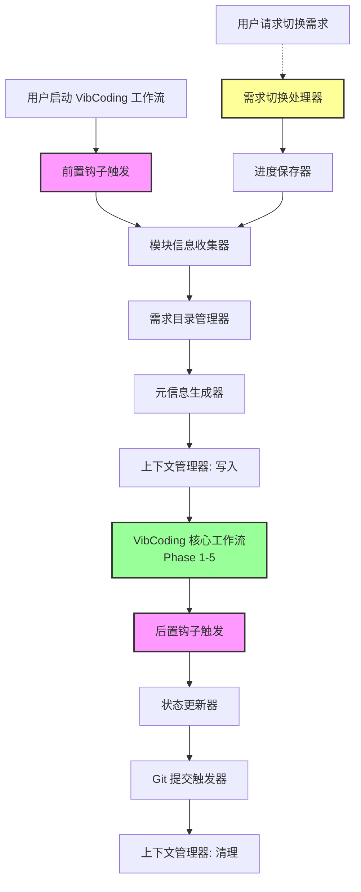
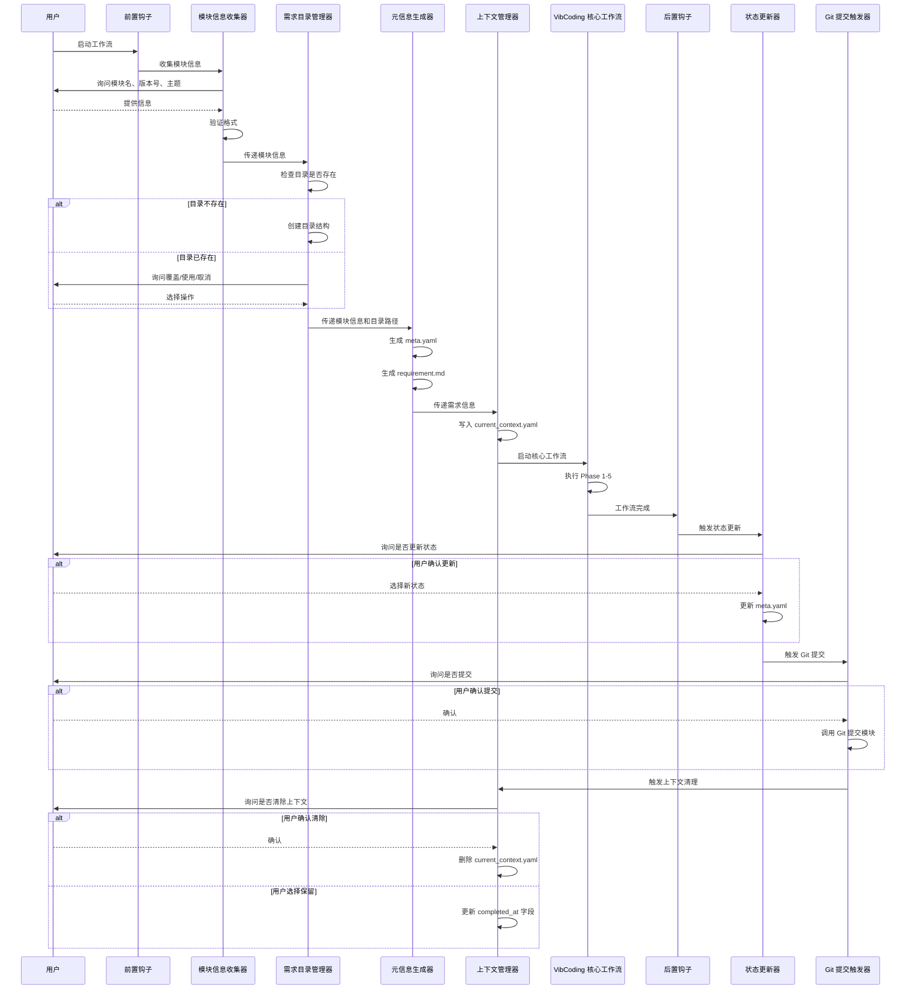
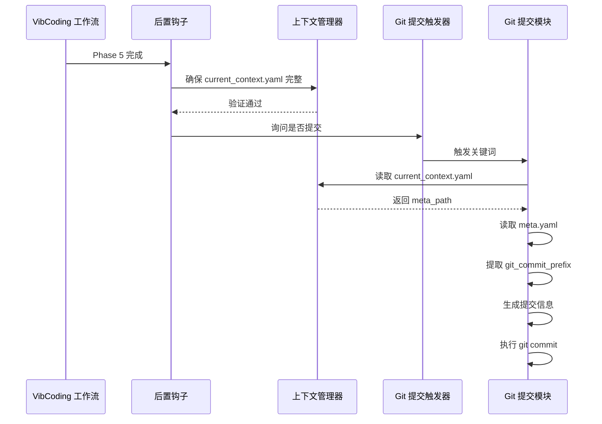
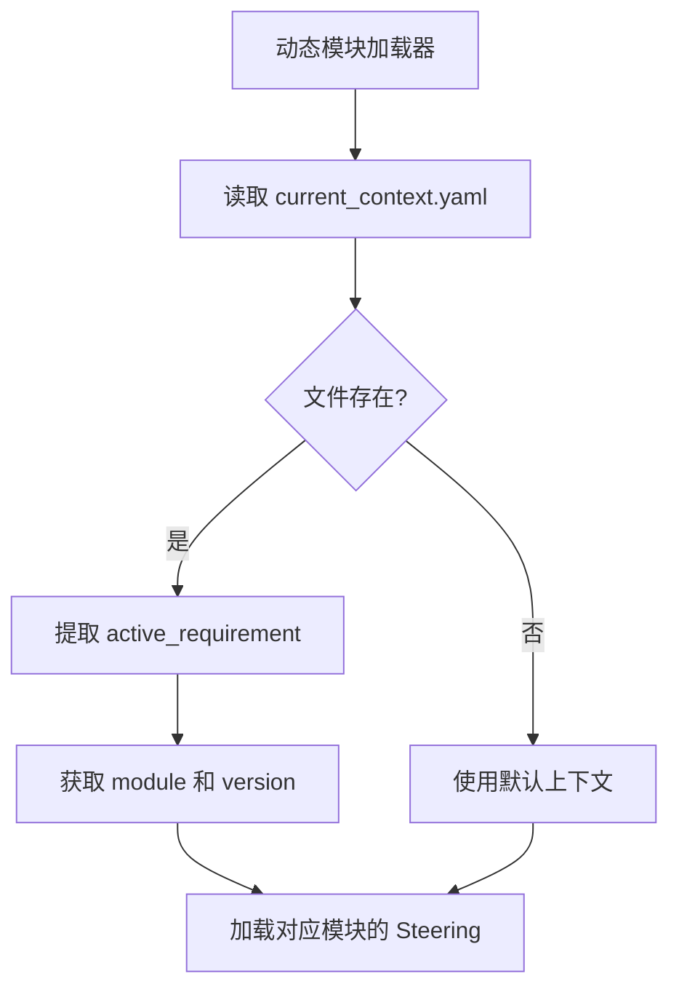

# 设计文档：VibCoding 工作流增强

## 概述

VibCoding 工作流增强功能是 Prompt 基座项目的核心增强模块，旨在为双轨工作流系统添加完整的模块化需求管理能力。该系统通过在工作流的关键节点插入前置钩子和后置钩子，实现了需求信息的自动收集、目录结构的自动创建、元信息的自动生成、以及与 Git 提交模块的无缝集成。

### 设计目标

1. **无缝集成**：不破坏现有 VibCoding 工作流的 5 个核心阶段，通过钩子方式增强功能
2. **自动化管理**：自动创建标准化的需求目录结构和元信息文件，减少手动操作
3. **上下文感知**：维护当前工作上下文，支持多需求并行开发和切换
4. **模块联动**：与动态模块加载器、Git 提交模块无缝集成，形成完整的开发工作流
5. **容错性**：优雅处理各种错误情况，提供降级选项，确保核心工作流不受影响

### 核心理念

- **钩子驱动**：通过前置钩子和后置钩子的方式增强工作流，保持核心逻辑独立
- **约定优于配置**：遵循标准的目录结构和文件命名约定
- **上下文驱动**：基于 current_context.yaml 维护当前工作状态
- **渐进式增强**：从基本功能开始，逐步增加高级特性（需求切换、进度保存）

## 架构

### 系统架构图



### 层级结构

```
VibCoding 工作流增强系统
├─ 前置钩子层
│  ├─ 模块信息收集器（收集模块名、版本号、需求主题）
│  ├─ 需求目录管理器（创建目录结构）
│  ├─ 元信息生成器（生成 meta.yaml）
│  └─ 上下文管理器（写入 current_context.yaml）
├─ 核心工作流层
│  └─ VibCoding Phase 1-5（不受影响）
├─ 后置钩子层
│  ├─ 状态更新器（更新 meta.yaml 状态）
│  ├─ Git 提交触发器（调用 Git 提交模块）
│  └─ 上下文管理器（清理 current_context.yaml）
└─ 中断处理层
   └─ 需求切换处理器（保存进度、切换需求）
```


### 数据流



## 组件和接口

### 组件 1：模块信息收集器（Module Info Collector）

**职责**：收集和验证模块名称、版本号、需求主题

**输入**：
- 用户输入（模块名称、版本号、需求主题）
- 现有模块列表（从 requirements/ 目录扫描）

**输出**：
- 验证通过的模块信息（module, version, theme）

**验证规则**：
- 模块名称：kebab-case 格式（小写字母、数字、短横线，不以短横线开头或结尾）
- 版本号：SemVer 2.0.0 格式（vMAJOR.MINOR.PATCH[-prerelease][+build]）

**伪代码**：

```python
def collect_module_info() -> dict:
    """
    收集模块信息
    
    Returns:
        {
            'module': str,
            'version': str,
            'theme': str
        }
    """
    # 扫描现有模块
    existing_modules = scan_existing_modules('requirements/')
    
    if existing_modules:
        # 提供选择：新建模块或选择现有模块
        choice = ask_user("选择现有模块还是创建新模块？", 
                         options=['新建模块', '选择现有模块'])
        
        if choice == '选择现有模块':
            module = ask_user("选择模块：", options=existing_modules)
            
            # 读取现有版本并推荐下一个版本
            existing_versions = scan_module_versions(f'requirements/{module}/')
            recommended_version = recommend_next_version(existing_versions)
            
            version = ask_user(f"输入版本号（推荐：{recommended_version}）：")
        else:
            module = ask_user("输入模块名称（kebab-case）：")
    else:
        module = ask_user("输入模块名称（kebab-case）：")
        version = ask_user("输入版本号（SemVer 格式）：")
    
    # 验证模块名称
    while not validate_kebab_case(module):
        log_error("模块名称格式无效，必须符合 kebab-case 格式")
        log_info("示例：my-module, user-auth, data-processor")
        module = ask_user("请重新输入模块名称：")
    
    # 验证版本号
    while not validate_semver(version):
        log_error("版本号格式无效，必须符合 SemVer 2.0.0 规范")
        log_info("示例：v1.0.0, v1.2.3-alpha.1, v2.0.0+20260304")
        version = ask_user("请重新输入版本号：")
    
    # 询问需求主题
    theme = ask_user("输入需求主题：")
    
    return {
        'module': module,
        'version': version,
        'theme': theme
    }


def validate_kebab_case(name: str) -> bool:
    """
    验证 kebab-case 格式
    
    Args:
        name: 模块名称
        
    Returns:
        是否符合格式
    """
    import re
    # 只包含小写字母、数字、短横线，不以短横线开头或结尾
    pattern = r'^[a-z0-9]+(-[a-z0-9]+)*$'
    return bool(re.match(pattern, name))


def validate_semver(version: str) -> bool:
    """
    验证 SemVer 2.0.0 格式
    
    Args:
        version: 版本号
        
    Returns:
        是否符合格式
    """
    import re
    # 移除可选的 'v' 前缀
    if version.startswith('v'):
        version = version[1:]
    
    # SemVer 2.0.0 正则表达式
    pattern = r'^(0|[1-9]\d*)\.(0|[1-9]\d*)\.(0|[1-9]\d*)(?:-((?:0|[1-9]\d*|\d*[a-zA-Z-][0-9a-zA-Z-]*)(?:\.(?:0|[1-9]\d*|\d*[a-zA-Z-][0-9a-zA-Z-]*))*))?(?:\+([0-9a-zA-Z-]+(?:\.[0-9a-zA-Z-]+)*))?$'
    return bool(re.match(pattern, version))


def recommend_next_version(existing_versions: list[str]) -> str:
    """
    推荐下一个版本号
    
    Args:
        existing_versions: 现有版本列表
        
    Returns:
        推荐的版本号
    """
    if not existing_versions:
        return 'v1.0.0'
    
    # 解析最新版本
    latest = max(existing_versions, key=parse_semver)
    major, minor, patch = parse_semver(latest)
    
    # 推荐 MINOR 版本升级
    return f'v{major}.{minor + 1}.0'


def parse_semver(version: str) -> tuple[int, int, int]:
    """
    解析 SemVer 版本号
    
    Args:
        version: 版本号字符串
        
    Returns:
        (major, minor, patch)
    """
    import re
    # 移除 'v' 前缀和预发布/构建后缀
    version = version.lstrip('v').split('-')[0].split('+')[0]
    parts = version.split('.')
    return (int(parts[0]), int(parts[1]), int(parts[2]))
```


### 组件 2：需求目录管理器（Requirement Directory Manager）

**职责**：创建和管理需求目录结构

**输入**：
- 模块信息（module, version）

**输出**：
- 创建的目录路径
- 操作结果（成功/失败）

**目录结构**：
```
requirements/{module}/{version}/
├── docs/                    # 需求相关文档
├── meta.yaml               # 需求元信息
└── requirement.md          # 需求文档
```

**伪代码**：

```python
def manage_requirement_directory(module: str, version: str) -> dict:
    """
    管理需求目录
    
    Args:
        module: 模块名称
        version: 版本号
        
    Returns:
        {
            'success': bool,
            'path': str,
            'action': 'created' | 'reused' | 'overwritten'
        }
    """
    req_path = f'requirements/{module}/{version}/'
    
    # 检查目录是否存在
    if directory_exists(req_path):
        # 询问用户操作
        choice = ask_user(
            f"目录 {req_path} 已存在，请选择操作：",
            options=['使用现有目录', '覆盖现有目录', '取消操作']
        )
        
        if choice == '取消操作':
            return {'success': False, 'path': None, 'action': 'cancelled'}
        
        elif choice == '覆盖现有目录':
            # 备份现有目录
            timestamp = get_current_timestamp()
            backup_path = f'requirements/{module}/{version}.backup.{timestamp}/'
            
            try:
                move_directory(req_path, backup_path)
                log_info(f"已备份现有目录到: {backup_path}")
            except Exception as e:
                log_error(f"备份失败: {e}")
                
                # 询问是否继续
                if not ask_user_confirm("备份失败，是否继续（可能导致数据丢失）？"):
                    return {'success': False, 'path': None, 'action': 'cancelled'}
            
            # 创建新目录
            create_directory(req_path)
            create_directory(f'{req_path}docs/')
            
            return {'success': True, 'path': req_path, 'action': 'overwritten'}
        
        else:  # 使用现有目录
            return {'success': True, 'path': req_path, 'action': 'reused'}
    
    else:
        # 创建新目录
        try:
            create_directory(req_path)
            create_directory(f'{req_path}docs/')
            log_info(f"已创建需求目录: {req_path}")
            
            # 检查是否为全新模块
            module_path = f'.kiro/modules/{module}/'
            if not directory_exists(module_path):
                # 询问是否初始化模块目录
                if ask_user_confirm(f"模块 {module} 不存在，是否自动初始化模块目录？"):
                    initialize_module_directory(module, version)
            
            return {'success': True, 'path': req_path, 'action': 'created'}
        
        except Exception as e:
            log_error(f"创建目录失败: {e}")
            return {'success': False, 'path': None, 'action': 'failed'}


def initialize_module_directory(module: str, version: str) -> bool:
    """
    初始化模块目录结构
    
    Args:
        module: 模块名称
        version: 版本号
        
    Returns:
        是否成功
    """
    module_path = f'.kiro/modules/{module}/{version}/'
    template_path = '.kiro/templates/module/'
    
    try:
        # 复制模板
        copy_directory(template_path, module_path)
        log_info(f"已初始化模块目录: {module_path}")
        return True
    
    except Exception as e:
        log_error(f"初始化模块目录失败: {e}")
        return False
```

### 组件 3：元信息生成器（Meta Info Generator）

**职责**：生成需求元信息文件（meta.yaml）和需求文档模板（requirement.md）

**输入**：
- 模块信息（module, version, theme）
- 需求目录路径

**输出**：
- 生成的 meta.yaml 文件路径
- 生成的 requirement.md 文件路径

**meta.yaml 格式**：
```yaml
theme: 需求主题
module: module-name
version: v1.0.0
author: yangzhuo
date: 2026-03-03
status: 开发中
description: 需求的简要描述
git_commit_prefix: feat(module-v1.0.0)
```

**伪代码**：

```python
def generate_meta_info(
    module: str,
    version: str,
    theme: str,
    req_path: str,
    action: str
) -> dict:
    """
    生成元信息文件
    
    Args:
        module: 模块名称
        version: 版本号
        theme: 需求主题
        req_path: 需求目录路径
        action: 目录操作类型（created/reused/overwritten）
        
    Returns:
        {
            'meta_path': str,
            'requirement_path': str,
            'success': bool
        }
    """
    meta_path = f'{req_path}meta.yaml'
    requirement_path = f'{req_path}requirement.md'
    
    # 如果是使用现有目录且 meta.yaml 已存在，保留不修改
    if action == 'reused' and file_exists(meta_path):
        log_info(f"保留现有 meta.yaml: {meta_path}")
        return {
            'meta_path': meta_path,
            'requirement_path': requirement_path,
            'success': True
        }
    
    # 生成 meta.yaml
    try:
        # 获取作者信息
        author = get_git_user_name() or 'yangzhuo'
        
        # 获取当前日期
        date = get_current_date()  # YYYY-MM-DD
        
        # 生成 git_commit_prefix
        # 格式：feat(module-version)
        # 保留版本号的完整格式（包括 'v' 前缀）
        git_commit_prefix = f'feat({module}-{version})'
        
        # 构建 meta.yaml 内容
        meta_content = f"""# 需求元信息

theme: {theme}
module: {module}
version: {version}
author: {author}
date: {date}
status: 开发中
description: {theme}
git_commit_prefix: {git_commit_prefix}
"""
        
        # 写入文件
        write_file(meta_path, meta_content)
        log_info(f"已生成 meta.yaml: {meta_path}")
        
        # 生成 requirement.md（从模板复制并填充）
        template_path = '.kiro/templates/requirement/requirement.md.template'
        if file_exists(template_path):
            template_content = read_file(template_path)
            
            # 替换模板变量
            requirement_content = template_content.replace('{module}', module)
            requirement_content = requirement_content.replace('{version}', version)
            requirement_content = requirement_content.replace('{theme}', theme)
            requirement_content = requirement_content.replace('{date}', date)
            
            write_file(requirement_path, requirement_content)
            log_info(f"已生成 requirement.md: {requirement_path}")
        
        return {
            'meta_path': meta_path,
            'requirement_path': requirement_path,
            'success': True
        }
    
    except Exception as e:
        log_error(f"生成元信息失败: {e}")
        return {
            'meta_path': None,
            'requirement_path': None,
            'success': False
        }


def get_git_user_name() -> str | None:
    """
    从 git config 获取用户名
    
    Returns:
        用户名或 None
    """
    try:
        result = run_command(['git', 'config', 'user.name'])
        if result.returncode == 0:
            return result.stdout.strip()
    except:
        pass
    return None


def get_current_date() -> str:
    """
    获取当前日期（YYYY-MM-DD 格式）
    
    Returns:
        日期字符串
    """
    from datetime import datetime
    return datetime.now().strftime('%Y-%m-%d')


def get_current_timestamp() -> str:
    """
    获取当前时间戳（YYYYMMDD_HHMMSS 格式）
    
    Returns:
        时间戳字符串
    """
    from datetime import datetime
    return datetime.now().strftime('%Y%m%d_%H%M%S')
```


### 组件 4：上下文管理器（Context Manager）

**职责**：管理当前工作上下文（current_context.yaml）

**输入**：
- 需求信息（module, version, theme, req_path, meta_path）
- 操作类型（write/update/clear）

**输出**：
- 操作结果（成功/失败）

**current_context.yaml 格式**：
```yaml
# 当前活跃需求信息
active_requirement:
  theme: 需求主题
  module: 模块名称
  version: 版本号
  requirement_path: requirements/module/version/
  meta_path: requirements/module/version/meta.yaml
  started_at: "2026-03-03 10:30:00"
  current_phase: null
  paused_at: null
  completed_at: null

# 当前工作环境
environment:
  current_directory: /path/to/project
  current_file: null
  current_file_type: null

# 更新时间
updated_at: "2026-03-03 10:30:00"
```

**伪代码**：

```python
def write_current_context(
    module: str,
    version: str,
    theme: str,
    req_path: str,
    meta_path: str
) -> bool:
    """
    写入当前上下文
    
    Args:
        module: 模块名称
        version: 版本号
        theme: 需求主题
        req_path: 需求目录路径
        meta_path: meta.yaml 文件路径
        
    Returns:
        是否成功
    """
    context_path = '.kiro/current_context.yaml'
    
    # 检查文件是否已存在
    if file_exists(context_path):
        choice = ask_user(
            "current_context.yaml 已存在，请选择操作：",
            options=['覆盖现有上下文', '取消操作']
        )
        
        if choice == '取消操作':
            return False
        
        # 备份现有文件
        timestamp = get_current_timestamp()
        backup_path = f'.kiro/current_context.yaml.backup.{timestamp}'
        
        try:
            copy_file(context_path, backup_path)
            log_info(f"已备份现有上下文到: {backup_path}")
        except Exception as e:
            log_warning(f"备份失败: {e}")
    
    # 构建上下文内容
    current_time = get_current_datetime()  # YYYY-MM-DD HH:MM:SS
    current_dir = get_current_directory()
    
    context_content = f"""# 当前活跃需求信息
active_requirement:
  theme: {theme}
  module: {module}
  version: {version}
  requirement_path: {req_path}
  meta_path: {meta_path}
  started_at: "{current_time}"
  current_phase: null
  paused_at: null
  completed_at: null

# 当前工作环境
environment:
  current_directory: {current_dir}
  current_file: null
  current_file_type: null

# 更新时间
updated_at: "{current_time}"
"""
    
    try:
        write_file(context_path, context_content)
        log_info(f"已写入当前上下文: {context_path}")
        return True
    except Exception as e:
        log_error(f"写入上下文失败: {e}")
        return False


def clear_current_context() -> bool:
    """
    清除当前上下文
    
    Returns:
        是否成功
    """
    context_path = '.kiro/current_context.yaml'
    
    if not file_exists(context_path):
        log_info("current_context.yaml 不存在，无需清除")
        return True
    
    choice = ask_user(
        "是否清除 current_context.yaml？",
        options=['清除', '保留（更新 completed_at）']
    )
    
    if choice == '清除':
        try:
            delete_file(context_path)
            log_info("已清除 current_context.yaml")
            return True
        except Exception as e:
            log_error(f"清除失败: {e}")
            return False
    
    else:  # 保留并更新 completed_at
        try:
            context = read_yaml(context_path)
            current_time = get_current_datetime()
            
            # 更新 completed_at 字段
            if 'active_requirement' not in context:
                context['active_requirement'] = {}
            context['active_requirement']['completed_at'] = current_time
            context['updated_at'] = current_time
            
            write_yaml(context_path, context)
            log_info("已更新 current_context.yaml 的 completed_at 字段")
            return True
        except Exception as e:
            log_error(f"更新失败: {e}")
            return False


def get_current_datetime() -> str:
    """
    获取当前日期时间（YYYY-MM-DD HH:MM:SS 格式）
    
    Returns:
        日期时间字符串
    """
    from datetime import datetime
    return datetime.now().strftime('%Y-%m-%d %H:%M:%S')
```

### 组件 5：状态更新器（Status Updater）

**职责**：更新需求元信息的状态字段

**输入**：
- meta.yaml 文件路径
- 新状态（可选）

**输出**：
- 更新结果（成功/失败）

**支持的状态**：
- 开发中
- 已完成
- 已暂停
- 已取消

**伪代码**：

```python
def update_requirement_status(meta_path: str) -> bool:
    """
    更新需求状态
    
    Args:
        meta_path: meta.yaml 文件路径
        
    Returns:
        是否成功
    """
    # 询问用户是否更新状态
    if not ask_user_confirm("是否更新需求状态？"):
        log_info("跳过状态更新")
        return True
    
    # 提供状态选项
    status_options = ['开发中', '已完成', '已暂停', '已取消']
    new_status = ask_user("选择新状态：", options=status_options)
    
    try:
        # 读取现有 meta.yaml
        meta = read_yaml(meta_path)
        
        # 更新状态
        meta['status'] = new_status
        
        # 添加/更新 updated_at 字段
        current_time = get_current_datetime()
        meta['updated_at'] = current_time
        
        # 写回文件
        write_yaml(meta_path, meta)
        log_info(f"已更新状态为: {new_status}")
        return True
    
    except Exception as e:
        log_error(f"更新状态失败: {e}")
        return False
```

### 组件 6：Git 提交触发器（Git Commit Trigger）

**职责**：触发 Git 提交模块

**输入**：
- current_context.yaml 路径

**输出**：
- 触发结果（成功/失败）

**伪代码**：

```python
def trigger_git_commit() -> bool:
    """
    触发 Git 提交
    
    Returns:
        是否成功
    """
    # 询问用户是否触发 Git 提交
    if not ask_user_confirm("是否触发 Git 提交？"):
        log_info("跳过 Git 提交")
        return True
    
    # 确保 current_context.yaml 存在且包含完整信息
    context_path = '.kiro/current_context.yaml'
    
    if not file_exists(context_path):
        log_error("current_context.yaml 不存在，无法触发 Git 提交")
        return False
    
    try:
        # 验证 current_context.yaml 内容
        context = read_yaml(context_path)
        
        if 'active_requirement' not in context:
            log_error("current_context.yaml 缺少 active_requirement 字段")
            return False
        
        active_req = context['active_requirement']
        required_fields = ['theme', 'module', 'version', 'meta_path']
        
        for field in required_fields:
            if field not in active_req:
                log_error(f"current_context.yaml 缺少必需字段: {field}")
                return False
        
        # 询问提交描述
        commit_desc = ask_user("输入提交描述：")
        
        # 调用 Git 提交模块
        # Git 提交模块会自动从 current_context.yaml 读取 meta_path 和提交前缀
        log_info("正在调用 Git 提交模块...")
        log_info(f"提交描述: {commit_desc}")
        log_info("Git 提交模块将从 current_context.yaml 读取需求信息")
        
        # 这里通过关键词触发 Git 提交模块
        # 实际实现中，Kiro 会识别关键词并调用对应模块
        trigger_keyword = f"提交代码: {commit_desc}"
        
        log_info(f"触发关键词: {trigger_keyword}")
        return True
    
    except Exception as e:
        log_error(f"触发 Git 提交失败: {e}")
        
        # 询问是否重试或跳过
        choice = ask_user(
            "Git 提交触发失败，请选择操作：",
            options=['重试', '跳过']
        )
        
        if choice == '重试':
            return trigger_git_commit()
        else:
            return False
```


### 组件 7：需求切换处理器（Requirement Switcher）

**职责**：处理需求切换，保存和恢复进度

**输入**：
- 当前需求信息
- 切换请求

**输出**：
- 切换结果（成功/失败）

**伪代码**：

```python
def handle_requirement_switch() -> bool:
    """
    处理需求切换
    
    Returns:
        是否成功
    """
    context_path = '.kiro/current_context.yaml'
    
    # 检查是否有当前需求
    if not file_exists(context_path):
        log_info("没有当前需求，直接开始新需求")
        # 重新执行模块信息收集
        return start_new_requirement()
    
    # 读取当前需求信息
    try:
        context = read_yaml(context_path)
        active_req = context.get('active_requirement', {})
        
        current_module = active_req.get('module')
        current_version = active_req.get('version')
        current_phase = active_req.get('current_phase')
        
        log_info(f"当前需求: {current_module} {current_version}")
        if current_phase:
            log_info(f"当前阶段: {current_phase}")
        
        # 询问是否保存进度
        if ask_user_confirm("是否保存当前进度？"):
            # 保存进度
            if not save_requirement_progress(context):
                log_error("保存进度失败")
                return False
        
        # 开始新需求
        return start_new_requirement()
    
    except Exception as e:
        log_error(f"处理需求切换失败: {e}")
        return False


def save_requirement_progress(context: dict) -> bool:
    """
    保存需求进度
    
    Args:
        context: 当前上下文
        
    Returns:
        是否成功
    """
    try:
        active_req = context['active_requirement']
        module = active_req['module']
        version = active_req['version']
        req_path = active_req['requirement_path']
        
        # 更新 current_context.yaml 的 paused_at 和 current_phase
        current_time = get_current_datetime()
        active_req['paused_at'] = current_time
        
        # 如果 current_phase 为空，设置为 "未知"
        if not active_req.get('current_phase'):
            active_req['current_phase'] = '未知'
        
        context['updated_at'] = current_time
        
        # 写回 current_context.yaml
        write_yaml('.kiro/current_context.yaml', context)
        
        # 备份完整进度信息到需求目录
        progress_path = f'{req_path}.workflow_progress.yaml'
        progress_content = {
            'requirement_info': active_req,
            'environment': context.get('environment', {}),
            'saved_at': current_time
        }
        
        write_yaml(progress_path, progress_content)
        log_info(f"已保存进度到: {progress_path}")
        return True
    
    except Exception as e:
        log_error(f"保存进度失败: {e}")
        return False


def restore_requirement_progress(module: str, version: str) -> bool:
    """
    恢复需求进度
    
    Args:
        module: 模块名称
        version: 版本号
        
    Returns:
        是否成功
    """
    req_path = f'requirements/{module}/{version}/'
    progress_path = f'{req_path}.workflow_progress.yaml'
    
    if not file_exists(progress_path):
        log_warning(f"进度文件不存在: {progress_path}")
        return False
    
    try:
        # 读取进度信息
        progress = read_yaml(progress_path)
        
        # 恢复到 current_context.yaml
        context = {
            'active_requirement': progress['requirement_info'],
            'environment': progress.get('environment', {}),
            'updated_at': get_current_datetime()
        }
        
        write_yaml('.kiro/current_context.yaml', context)
        log_info(f"已恢复进度: {module} {version}")
        log_info(f"上次暂停阶段: {progress['requirement_info'].get('current_phase')}")
        return True
    
    except Exception as e:
        log_error(f"恢复进度失败: {e}")
        return False


def start_new_requirement() -> bool:
    """
    开始新需求
    
    Returns:
        是否成功
    """
    # 重新执行模块信息收集流程
    module_info = collect_module_info()
    
    # 执行后续流程
    dir_result = manage_requirement_directory(
        module_info['module'],
        module_info['version']
    )
    
    if not dir_result['success']:
        return False
    
    meta_result = generate_meta_info(
        module_info['module'],
        module_info['version'],
        module_info['theme'],
        dir_result['path'],
        dir_result['action']
    )
    
    if not meta_result['success']:
        return False
    
    return write_current_context(
        module_info['module'],
        module_info['version'],
        module_info['theme'],
        dir_result['path'],
        meta_result['meta_path']
    )
```

## 数据模型

### 需求元信息模型（Requirement Meta）

```yaml
# requirements/{module}/{version}/meta.yaml

theme: VibCoding 工作流增强
module: vibcoding-workflow-enhancement
version: v1.0
author: yangzhuo
date: 2026-03-03
status: 开发中
description: 为 VibCoding 工作流添加模块化需求管理能力
git_commit_prefix: feat(vibcoding-workflow-enhancement-1.0)
updated_at: "2026-03-03 15:30:00"  # 可选，状态更新时添加
```

### 当前上下文模型（Current Context）

```yaml
# .kiro/current_context.yaml

# 当前活跃需求信息
active_requirement:
  theme: VibCoding 工作流增强
  module: vibcoding-workflow-enhancement
  version: v1.0
  requirement_path: requirements/vibcoding-workflow-enhancement/v1.0/
  meta_path: requirements/vibcoding-workflow-enhancement/v1.0/meta.yaml
  started_at: "2026-03-03 10:00:00"
  current_phase: "Phase 2"  # 可选，工作流当前阶段
  paused_at: null  # 可选，暂停时间
  completed_at: null  # 可选，完成时间

# 当前工作环境
environment:
  current_directory: /path/to/project
  current_file: design.md
  current_file_type: .md

# 更新时间
updated_at: "2026-03-03 10:00:00"
```

### 工作流进度模型（Workflow Progress）

```yaml
# requirements/{module}/{version}/.workflow_progress.yaml

# 需求信息（从 current_context.yaml 复制）
requirement_info:
  theme: VibCoding 工作流增强
  module: vibcoding-workflow-enhancement
  version: v1.0
  requirement_path: requirements/vibcoding-workflow-enhancement/v1.0/
  meta_path: requirements/vibcoding-workflow-enhancement/v1.0/meta.yaml
  started_at: "2026-03-03 10:00:00"
  current_phase: "Phase 2"
  paused_at: "2026-03-03 14:30:00"
  completed_at: null

# 环境信息
environment:
  current_directory: /path/to/project
  current_file: design.md
  current_file_type: .md

# 保存时间
saved_at: "2026-03-03 14:30:00"
```

### 需求文档模板模型（Requirement Template）

```markdown
# requirements/{module}/{version}/requirement.md

# {theme}

## 模块信息

- 模块名称：{module}
- 版本号：{version}
- 创建日期：{date}

## 需求背景

[描述需求的背景和动机]

## 核心功能需求

[列出核心功能需求]

## 技术约束

[列出技术约束]

## 目标用户

[描述目标用户]

## 使用场景

[描述使用场景]

## 成功标准

[定义成功标准]
```


## 正确性属性

*属性是一个特征或行为，应该在系统的所有有效执行中保持为真——本质上是关于系统应该做什么的正式陈述。属性作为人类可读规范和机器可验证正确性保证之间的桥梁。*

### 属性反思

在编写正确性属性之前，我对 prework 分析中识别的可测试需求进行了反思，以消除冗余：

**合并的属性**：
- 需求 1.2（kebab-case 验证）和 1.3（SemVer 验证）可以合并为一个通用的"输入验证正确性"属性
- 需求 2.2（创建目录）和 2.5（创建子目录）可以合并为"目录结构创建正确性"属性
- 需求 3.2（包含必需字段）和 3.3（status 默认值）、3.4（git_commit_prefix 格式）可以合并为"meta.yaml 生成正确性"属性
- 需求 6.1（写入文件）和 6.2（遵循结构）可以合并为"上下文文件写入正确性"属性
- 需求 7.2（保存进度）和 7.4（更新上下文）可以合并为"需求切换状态一致性"属性

**保留的独立属性**：
- 版本号推荐算法（需求 1.6）- 独特的业务逻辑
- 备份机制（需求 2.4, 6.4）- 重要的数据保护逻辑
- 文件保留逻辑（需求 3.7）- 特殊的条件处理
- Git 提交前置条件（需求 5.2）- 模块间集成的关键验证
- 进度恢复（需求 7.6）- Round-trip 属性

### 属性 1：输入验证正确性

*对于任意*用户输入的字符串，系统应该正确识别其是否符合 kebab-case 格式或 SemVer 2.0.0 格式，且验证结果与格式规范完全一致。

**验证需求**：需求 1.2, 1.3

### 属性 2：版本号推荐正确性

*对于任意*现有版本号列表，系统推荐的下一个版本号应该是最新版本的 MINOR 版本升级（即 vX.Y.Z → vX.(Y+1).0）。

**验证需求**：需求 1.6

### 属性 3：模块信息记录一致性

*对于任意*用户提供的模块信息（模块名、版本号、主题），系统记录的信息应该与用户输入完全一致。

**验证需求**：需求 1.8

### 属性 4：目录结构创建正确性

*对于任意*模块名称和版本号，当目录不存在时，系统应该创建 `requirements/{module}/{version}/` 目录和 `docs/` 子目录，且目录路径格式正确。

**验证需求**：需求 2.2, 2.5

### 属性 5：目录备份正确性

*对于任意*已存在的需求目录，当用户选择覆盖时，系统应该先将现有目录备份到 `requirements/{module}/{version}.backup.{timestamp}/`，且备份目录的内容与原目录完全一致。

**验证需求**：需求 2.4

### 属性 6：模块目录初始化正确性

*对于任意*全新模块，当用户确认初始化时，系统应该从 `.kiro/templates/module/` 复制模板到 `.kiro/modules/{module}/{version}/`，且复制的目录结构与模板完全一致。

**验证需求**：需求 2.8

### 属性 7：meta.yaml 生成正确性

*对于任意*模块信息，生成的 meta.yaml 文件应该包含所有必需字段（theme、module、version、author、date、status、description、git_commit_prefix），且 status 初始化为"开发中"，git_commit_prefix 格式为 `feat({module}-{version})`。

**验证需求**：需求 3.1, 3.2, 3.3, 3.4

### 属性 8：author 字段获取降级正确性

*对于任意*系统环境，当 `git config user.name` 可用时，author 字段应该使用该值；当不可用时，应该使用默认值"yangzhuo"。

**验证需求**：需求 3.5

### 属性 9：日期格式正确性

*对于任意*时间点，生成的 date 字段应该符合 YYYY-MM-DD 格式，updated_at 和时间戳字段应该符合 YYYY-MM-DD HH:MM:SS 格式。

**验证需求**：需求 3.6, 4.4

### 属性 10：文件保留正确性

*对于任意*已存在的 meta.yaml 文件，当用户选择使用现有目录时，系统应该保留该文件不做任何修改，且文件内容与操作前完全一致。

**验证需求**：需求 3.7

### 属性 11：需求文档模板填充正确性

*对于任意*模块信息，从模板生成的 requirement.md 文件应该正确替换所有模板变量（{module}、{version}、{theme}、{date}），且替换后的值与输入信息一致。

**验证需求**：需求 3.8

### 属性 12：状态更新正确性

*对于任意*meta.yaml 文件和新状态，更新后的文件应该包含新的 status 字段值和 updated_at 字段，且 updated_at 的时间晚于或等于原 date 字段。

**验证需求**：需求 4.3, 4.4

### 属性 13：文件不变性正确性

*对于任意*meta.yaml 文件，当用户选择不更新状态时，文件内容应该与操作前完全一致（包括所有字段和格式）。

**验证需求**：需求 4.5

### 属性 14：Git 提交前置条件验证正确性

*对于任意*current_context.yaml 文件，在触发 Git 提交前，系统应该验证文件存在且包含所有必需字段（theme、module、version、meta_path），缺少任何字段都应该阻止提交。

**验证需求**：需求 5.2

### 属性 15：上下文文件写入正确性（Round-trip）

*对于任意*需求信息，将其写入 current_context.yaml 后再读取，应该得到完全相同的需求信息（包括所有字段和嵌套结构）。

**验证需求**：需求 6.1, 6.2

### 属性 16：上下文文件备份正确性

*对于任意*已存在的 current_context.yaml 文件，当用户选择覆盖时，系统应该先将现有文件备份到 `.kiro/current_context.yaml.backup.{timestamp}`，且备份文件的内容与原文件完全一致。

**验证需求**：需求 6.4

### 属性 17：上下文文件删除正确性

*对于任意*current_context.yaml 文件，当用户确认清除时，系统应该删除该文件，且文件系统中不再存在该文件。

**验证需求**：需求 6.6

### 属性 18：completed_at 字段更新正确性

*对于任意*current_context.yaml 文件，当用户选择保留上下文时，系统应该在 active_requirement.completed_at 字段中记录当前时间，且该时间晚于或等于 started_at 字段。

**验证需求**：需求 6.7

### 属性 19：需求切换状态一致性

*对于任意*当前需求，当用户确认保存进度并切换到新需求时，系统应该：
1. 在 current_context.yaml 中更新 paused_at 和 current_phase 字段
2. 在 requirements/{module}/{version}/.workflow_progress.yaml 中保存完整进度信息
3. 两个文件中的需求信息应该完全一致

**验证需求**：需求 7.2, 7.4

### 属性 20：快速切换正确性

*对于任意*当前需求，当用户选择不保存进度并切换到新需求时，系统应该直接更新 current_context.yaml 为新需求信息，且不创建 .workflow_progress.yaml 文件。

**验证需求**：需求 7.5

### 属性 21：进度恢复正确性（Round-trip）

*对于任意*保存的进度信息，从 .workflow_progress.yaml 恢复到 current_context.yaml 后，active_requirement 字段的内容应该与保存时完全一致。

**验证需求**：需求 7.6

### 属性 22：前置钩子执行顺序正确性

*对于任意*工作流启动，前置钩子应该按以下顺序执行：模块信息收集 → 需求目录创建 → 元信息生成 → 当前上下文写入，且每个步骤只有在前一步骤成功后才执行。

**验证需求**：需求 9.1

### 属性 23：后置钩子执行顺序正确性

*对于任意*工作流结束，后置钩子应该按以下顺序执行：需求状态更新 → Git 提交触发 → 上下文清理询问，且每个步骤只有在前一步骤完成后才执行。

**验证需求**：需求 9.2

### 属性 24：核心工作流隔离性

*对于任意*增强功能的执行（成功或失败），VibCoding 工作流的 5 个核心阶段（理解需求、设计方案、实现、验证、总结反思）应该不受影响，能够正常执行。

**验证需求**：需求 9.4

### 属性 25：降级选项可用性

*对于任意*增强功能执行失败的情况，系统应该提供降级选项（重试、跳过、取消），且选择降级选项后核心工作流能够继续执行。

**验证需求**：需求 9.5


## 错误处理

### 错误类型和处理策略

| 错误类型 | 触发条件 | 处理策略 | 影响范围 |
|---------|---------|---------|---------|
| 模块名称格式无效 | 不符合 kebab-case 格式 | 显示格式要求和示例，要求重新输入 | 单次输入 |
| 版本号格式无效 | 不符合 SemVer 2.0.0 格式 | 显示格式规范和示例，要求重新输入 | 单次输入 |
| 需求目录已存在 | 目录路径冲突 | 询问用户选择（使用/覆盖/取消） | 单个目录 |
| 目录创建失败 | 文件系统错误、权限不足 | 显示错误信息，询问重试或取消 | 全局（无法继续） |
| 目录备份失败 | 文件系统错误 | 警告用户，询问是否继续（可能丢失数据） | 单个目录 |
| meta.yaml 生成失败 | 文件写入错误 | 显示错误信息，询问重试或取消 | 单个文件 |
| git config 读取失败 | Git 未配置或不可用 | 使用默认 author 值 | 降级处理 |
| current_context.yaml 已存在 | 文件冲突 | 询问用户选择（覆盖/取消） | 单个文件 |
| current_context.yaml 备份失败 | 文件系统错误 | 警告用户，继续操作 | 单个文件 |
| current_context.yaml 格式错误 | YAML 解析失败 | 显示解析错误，提供修复建议 | 单个文件 |
| current_context.yaml 缺少字段 | 必需字段不存在 | 显示缺少的字段，阻止 Git 提交 | Git 提交功能 |
| Git 提交模块调用失败 | 模块不可用或执行错误 | 显示失败原因，询问重试或跳过 | Git 提交功能 |
| 进度文件保存失败 | 文件写入错误 | 显示错误信息，询问重试或放弃保存 | 进度保存功能 |
| 进度文件读取失败 | 文件不存在或格式错误 | 显示错误信息，无法恢复进度 | 进度恢复功能 |
| 模块目录初始化失败 | 模板不存在或复制失败 | 显示错误信息，继续需求创建流程 | 模块初始化功能 |

### 错误恢复机制

1. **输入验证循环**：对于格式验证错误，持续提示用户重新输入，直到输入有效
2. **降级处理**：当可选功能失败时（如 git config 读取），使用默认值继续
3. **用户选择**：对于可能导致数据丢失的操作（如备份失败），询问用户是否继续
4. **重试机制**：对于临时性错误（如文件系统繁忙），提供重试选项
5. **跳过选项**：对于非关键功能（如 Git 提交），提供跳过选项以保证核心流程继续

### 错误日志格式

```
[ERROR] [VibCodingWorkflow] 错误类型: 具体错误信息
[WARNING] [VibCodingWorkflow] 警告类型: 具体警告信息
[INFO] [VibCodingWorkflow] 信息类型: 具体信息内容
```

示例：
```
[ERROR] [VibCodingWorkflow] 模块名称格式无效: "My_Module" 不符合 kebab-case 格式
[WARNING] [VibCodingWorkflow] 目录备份失败: 权限不足，继续操作可能导致数据丢失
[INFO] [VibCodingWorkflow] 已创建需求目录: requirements/my-module/v1.0/
[INFO] [VibCodingWorkflow] 已生成 meta.yaml: requirements/my-module/v1.0/meta.yaml
```

## 测试策略

### 双重测试方法

本项目采用**单元测试**和**基于属性的测试**相结合的方法，确保全面的测试覆盖。

#### 单元测试

单元测试用于验证特定示例、边界情况和错误条件。单元测试应该聚焦于：
- 特定示例：演示正确行为的具体案例
- 集成点：组件之间的交互
- 边界情况：空输入、特殊字符、极端值
- 错误条件：文件不存在、格式错误、权限问题

**测试场景**：

1. **模块信息收集**：
   - 示例：输入有效的模块名和版本号
   - 边界：空输入、特殊字符、超长字符串
   - 错误：无效的 kebab-case 格式、无效的 SemVer 格式

2. **需求目录管理**：
   - 示例：创建新目录、使用现有目录、覆盖现有目录
   - 边界：目录路径包含特殊字符
   - 错误：权限不足、磁盘空间不足

3. **元信息生成**：
   - 示例：生成标准 meta.yaml
   - 边界：模块名或版本号包含特殊字符
   - 错误：文件写入失败、git config 不可用

4. **上下文管理**：
   - 示例：写入新上下文、覆盖现有上下文、清除上下文
   - 边界：current_context.yaml 已存在
   - 错误：文件写入失败、YAML 格式错误

5. **需求切换**：
   - 示例：保存进度并切换、不保存进度切换、恢复进度
   - 边界：没有当前需求时切换
   - 错误：进度文件保存失败、进度文件读取失败

6. **工作流集成**：
   - 示例：前置钩子执行、后置钩子执行、中断处理
   - 边界：工作流各阶段的集成点
   - 错误：增强功能失败时的降级处理

#### 基于属性的测试

基于属性的测试用于验证系统在所有可能输入下的正确性。属性测试应该覆盖通用规则和不变量。

**测试配置**：
- 每个属性测试运行 **最少 100 次迭代**
- 使用随机生成的输入数据
- 每个测试标记为：`Feature: vibcoding-workflow-enhancement, Property {number}: {property_text}`

**属性测试列表**：

1. **属性 1：输入验证正确性**
   - 生成器：随机生成字符串（包含有效和无效的 kebab-case、SemVer 格式）
   - 验证：验证结果与格式规范一致

2. **属性 2：版本号推荐正确性**
   - 生成器：随机生成版本号列表
   - 验证：推荐版本是最新版本的 MINOR 升级

3. **属性 3：模块信息记录一致性**
   - 生成器：随机生成模块信息
   - 验证：记录的信息与输入一致

4. **属性 4：目录结构创建正确性**
   - 生成器：随机生成模块名和版本号
   - 验证：创建的目录路径和结构正确

5. **属性 5：目录备份正确性**
   - 生成器：创建随机目录内容
   - 验证：备份目录内容与原目录一致

6. **属性 6：模块目录初始化正确性**
   - 生成器：随机生成模块名和版本号
   - 验证：复制的目录结构与模板一致

7. **属性 7：meta.yaml 生成正确性**
   - 生成器：随机生成模块信息
   - 验证：生成的 meta.yaml 包含所有必需字段且格式正确

8. **属性 8：author 字段获取降级正确性**
   - 生成器：模拟 git config 可用/不可用的环境
   - 验证：author 字段值符合降级逻辑

9. **属性 9：日期格式正确性**
   - 生成器：随机时间点
   - 验证：生成的日期字段符合指定格式

10. **属性 10：文件保留正确性**
    - 生成器：创建随机 meta.yaml 内容
    - 验证：保留操作后文件内容不变

11. **属性 11：需求文档模板填充正确性**
    - 生成器：随机生成模块信息
    - 验证：模板变量被正确替换

12. **属性 12：状态更新正确性**
    - 生成器：随机生成 meta.yaml 和新状态
    - 验证：更新后的文件包含新状态和 updated_at

13. **属性 13：文件不变性正确性**
    - 生成器：创建随机 meta.yaml 内容
    - 验证：不更新操作后文件内容不变

14. **属性 14：Git 提交前置条件验证正确性**
    - 生成器：随机生成 current_context.yaml（包含/缺少必需字段）
    - 验证：缺少字段时阻止提交

15. **属性 15：上下文文件写入正确性（Round-trip）**
    - 生成器：随机生成需求信息
    - 验证：写入后读取的内容与原内容一致

16. **属性 16：上下文文件备份正确性**
    - 生成器：创建随机 current_context.yaml 内容
    - 验证：备份文件内容与原文件一致

17. **属性 17：上下文文件删除正确性**
    - 生成器：创建 current_context.yaml 文件
    - 验证：删除后文件不存在

18. **属性 18：completed_at 字段更新正确性**
    - 生成器：创建随机 current_context.yaml
    - 验证：completed_at 晚于或等于 started_at

19. **属性 19：需求切换状态一致性**
    - 生成器：随机生成当前需求信息
    - 验证：两个文件中的需求信息一致

20. **属性 20：快速切换正确性**
    - 生成器：随机生成当前需求和新需求
    - 验证：不创建进度文件且上下文更新为新需求

21. **属性 21：进度恢复正确性（Round-trip）**
    - 生成器：随机生成进度信息
    - 验证：保存后恢复的内容与原内容一致

22. **属性 22：前置钩子执行顺序正确性**
    - 生成器：模拟工作流启动
    - 验证：各步骤按顺序执行

23. **属性 23：后置钩子执行顺序正确性**
    - 生成器：模拟工作流结束
    - 验证：各步骤按顺序执行

24. **属性 24：核心工作流隔离性**
    - 生成器：模拟增强功能失败
    - 验证：核心工作流不受影响

25. **属性 25：降级选项可用性**
    - 生成器：模拟各种失败场景
    - 验证：提供降级选项且核心流程继续

### 测试工具选择

由于这是一个 **Prompt 工程项目**，测试策略需要调整：

#### Prompt 测试方法

1. **手动验证测试**：
   - 模拟用户输入，观察系统行为
   - 验证生成的文件内容和格式
   - 检查错误处理和用户提示

2. **配置文件测试套件**：
   - 创建测试用的模块信息
   - 创建测试用的目录结构
   - 验证各组件的输出

3. **集成测试**：
   - 测试与 VibCoding 工作流的集成
   - 测试与 Git 提交模块的集成
   - 测试与动态模块加载器的集成


## 实现注意事项

### Prompt 工程实现

由于这是一个 Prompt 工程项目，实现方式与传统编程不同：

1. **修改 workflow_selector.md**：
   - 在工作流选择器中添加前置钩子和后置钩子的逻辑
   - 前置钩子在 Phase 1 之前执行
   - 后置钩子在 Phase 5 之后执行

2. **钩子实现方式**：
   ```markdown
   ## 前置钩子：需求信息收集
   
   在开始 VibCoding 工作流之前，执行以下步骤：
   
   1. 询问用户提供模块信息
   2. 验证输入格式
   3. 创建需求目录结构
   4. 生成 meta.yaml 和 requirement.md
   5. 写入 current_context.yaml
   
   完成后，继续执行 Phase 1...
   ```

3. **中断处理实现**：
   - 在工作流的任意阶段，监听用户的切换需求请求
   - 提供明确的切换命令（如"切换需求"、"switch requirement"）
   - 暂停当前工作流，执行需求切换逻辑

4. **错误处理实现**：
   - 每个步骤都应该包含错误处理逻辑
   - 提供清晰的错误信息和恢复选项
   - 确保错误不会导致工作流中断

### 文件操作约定

1. **路径约定**：
   - 需求目录：`requirements/{module}/{version}/`
   - 模块目录：`.kiro/modules/{module}/{version}/`
   - 上下文文件：`.kiro/current_context.yaml`
   - 进度文件：`requirements/{module}/{version}/.workflow_progress.yaml`

2. **文件命名约定**：
   - 元信息文件：`meta.yaml`
   - 需求文档：`requirement.md`
   - 备份文件：`{原文件名}.backup.{timestamp}`

3. **YAML 格式约定**：
   - 使用 2 空格缩进
   - 字符串值使用双引号（当包含特殊字符时）
   - 日期时间格式：YYYY-MM-DD HH:MM:SS
   - 日期格式：YYYY-MM-DD

### 与现有模块的集成

1. **与动态模块加载器集成**：
   - current_context.yaml 的格式必须与动态模块加载器兼容
   - 使用嵌套结构（active_requirement + environment）
   - 确保字段名称一致

2. **与 Git 提交模块集成**：
   - Git 提交模块从 current_context.yaml 读取 meta_path
   - 从 meta.yaml 读取 git_commit_prefix
   - 通过关键词触发 Git 提交模块

3. **与 VibCoding 工作流集成**：
   - 不修改现有 5 个核心阶段的逻辑
   - 通过钩子方式增强功能
   - 提供降级选项以保证核心流程不受影响

## 系统联动

### 与 VibCoding 工作流的集成


**前置钩子执行时机**：
- 在 Phase 1 开始之前
- 用户明确启动 VibCoding 工作流时

**后置钩子执行时机**：
- 在 Phase 5 完成之后
- 所有核心阶段都已完成时

**中断处理时机**：
- 在任意 Phase 执行过程中
- 用户明确请求切换需求时

### 与 Git 提交模块的集成



**集成要点**：
1. current_context.yaml 必须包含完整的需求信息
2. Git 提交模块通过关键词触发（"提交代码: {描述}"）
3. Git 提交模块自动从 current_context.yaml 读取 meta_path
4. Git 提交模块自动从 meta.yaml 读取 git_commit_prefix

### 与动态模块加载器的集成



**集成要点**：
1. current_context.yaml 的格式必须与动态模块加载器兼容
2. 使用嵌套结构（active_requirement + environment + updated_at）
3. 字段名称必须一致（theme、module、version、requirement_path、meta_path）
4. 动态模块加载器可以根据当前需求信息调整模块激活状态

## 非功能性需求

### 性能需求

1. 模块信息收集和验证应该在 1 秒内完成
2. 目录创建和文件生成应该在 2 秒内完成
3. 上下文文件读写应该在 1 秒内完成
4. 需求切换和进度保存应该在 3 秒内完成

### 可靠性需求

1. 所有文件修改操作必须先备份再修改，确保任何异常情况下都不会丢失用户数据
2. 单个步骤的执行失败，不得影响整个工作流的继续执行，必须提供降级/跳过选项
3. 所有 YAML 文件的读写必须进行格式验证，防止格式错误导致系统崩溃

### 兼容性需求

1. 完全兼容现有的 VibCoding 双轨工作流（简单工作流/复杂工作流）
2. 完全兼容「动态模块加载器」「Git 提交自动化联动」的所有数据格式和接口规范
3. 支持 Windows、macOS、Linux 全平台的文件系统操作
4. 支持中文和英文的用户交互

### 可维护性需求

1. 所有工作流增强逻辑与现有工作流核心逻辑完全解耦，通过钩子方式集成，便于后续修改和扩展
2. 所有文件路径、命名规范、字段格式均采用统一常量定义，避免硬编码
3. 所有组件都应该有清晰的职责边界，便于独立测试和维护
4. 所有错误信息都应该包含错误类型、具体原因和解决建议

### 可用性需求

1. 所有用户交互都应该提供清晰的提示和选项
2. 所有输入验证都应该提供格式要求和示例
3. 所有错误信息都应该易于理解，避免技术术语
4. 所有操作都应该提供确认步骤，防止误操作

## 需求-设计追溯矩阵

本矩阵确保设计完全覆盖需求文档中的所有条目，避免需求遗漏。

| 需求编号 | 需求标题 | 对应设计组件/章节 | 覆盖状态 |
|---------|---------|-----------------|---------|
| 需求 1 | 工作流启动时的模块信息收集 | 组件 1：模块信息收集器 | ✅ 已覆盖 |
| 需求 2 | 自动创建需求目录结构 | 组件 2：需求目录管理器 | ✅ 已覆盖 |
| 需求 3 | 自动生成需求元信息文件 | 组件 3：元信息生成器 | ✅ 已覆盖 |
| 需求 4 | 工作流结束时的状态更新 | 组件 5：状态更新器 | ✅ 已覆盖 |
| 需求 5 | Git 提交触发选项 | 组件 6：Git 提交触发器 | ✅ 已覆盖 |
| 需求 6 | 当前上下文管理 | 组件 4：上下文管理器 | ✅ 已覆盖 |
| 需求 7 | 需求切换支持 | 组件 7：需求切换处理器 | ✅ 已覆盖 |
| 需求 8 | 错误处理和验证 | 错误处理章节 | ✅ 已覆盖 |
| 需求 9 | 工作流集成点 | 架构：钩子层级<br>系统联动章节 | ✅ 已覆盖 |
| 非功能性需求 | 性能、可靠性、兼容性、可维护性 | 非功能性需求章节 | ✅ 已覆盖 |

**覆盖率统计**：
- 总需求数：9 个（功能需求）+ 1 个（非功能性需求）= 10 个
- 已覆盖：10 个
- 未覆盖：0 个
- 覆盖率：100%

## 总结

VibCoding 工作流增强功能通过前置钩子和后置钩子的方式，为双轨工作流系统添加了完整的模块化需求管理能力。该设计遵循以下核心原则：

1. **无缝集成**：不破坏现有工作流的核心逻辑，通过钩子方式增强功能
2. **自动化管理**：自动创建标准化的目录结构和元信息文件，减少手动操作
3. **上下文感知**：维护当前工作上下文，支持多需求并行开发和切换
4. **模块联动**：与动态模块加载器、Git 提交模块无缝集成，形成完整的开发工作流
5. **容错性**：优雅处理各种错误情况，提供降级选项，确保核心工作流不受影响

该设计完全覆盖了需求文档中的所有功能需求和非功能性需求，并通过 25 个正确性属性确保系统的正确性和可靠性。
